# Canned-Emotions - 听点什么
> 以 Gemini Embedding 2 为核心的 Android 本地音乐智能播放工具。  
> A smart local music playing tool powered by Gemini Embedding 2.

你是否也和我一样，有数量庞大，种类繁多的本地音乐库，却有时找不到想听的歌？或是本地播放器的随机算法上一秒还在播放摇滚乐，下一秒又突然开始播放温柔的古典音乐？  

这个软件可以在一定程度上改善你的播放体验，更丝滑，更应景，更称心如意。   

**下载 [GitHub Release](https://github.com/bbblllllocck/Canned-Emotions/releases)**

在看到 Gemini Embedding 2 发布后我花了近两周时间构建出了这个原型。利用模型的多模态能力为音频生成向量再进行对称检索来获得更智能的音乐播放能力。  

基于我对模型和音乐播放的浅显见解，我（暂时）构想出了两种基础的操作方式：

________________________________________________________________________________________

## 示例

### 对称检索对应氛围的音乐

> 描述当前的氛围，音乐的类型，感觉，检索出适合的音乐。

#### **示例1**

检索词：  
Upbeat Pop-Rock,124BPM。饱满的流行吉他扫弦配合清脆的架子鼓节奏。映射阳光洒落桌面的明亮感与充满动力的、持续推进的工作状态。  

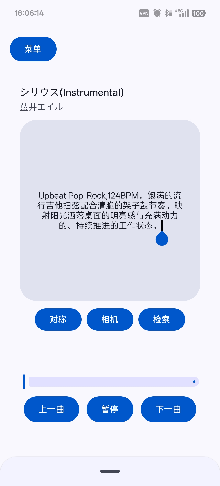

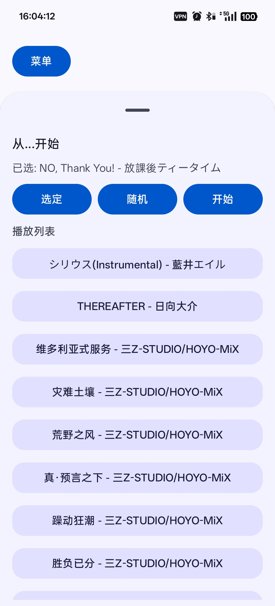

聆听对应的搜索结果（节选）：

（为了规避版权提供流媒体平台的播放链接）

[シリウス(Instrumental) - 藍井エイル](https://music.163.com/#/song?id=27969040)  
[THEREAFTER - 日向大介](https://music.163.com/#/song?id=480654)  
[维多利亚式服务 - 三Z-STUDIO/HOYO-MiX](https://music.163.com/#/song?id=2657833383)   
[灾难土壤 - 三Z-STUDIO/HOYO-MiX](https://music.163.com/#/song?id=2657833393)  
[荒野之风 - 三Z-STUDIO/HOYO-MiX](https://music.163.com/#/song?id=2657830928)  
[真·预言之下 - 三Z-STUDIO/HOYO-MiX](https://music.163.com/#/song?id=2657830947)  
[躁动狂潮 - 三Z-STUDIO/HOYO-MiX](https://music.163.com/#/song?id=2658039024)  
[胜负已分 - 三Z-STUDIO/HOYO-MiX](https://music.163.com/#/song?id=2658039013)  

[了解作为示例的音乐库](docs/musicLib.md)

#### **示例2**

检索词：  
温暖的床铺，温馨的休息环境  

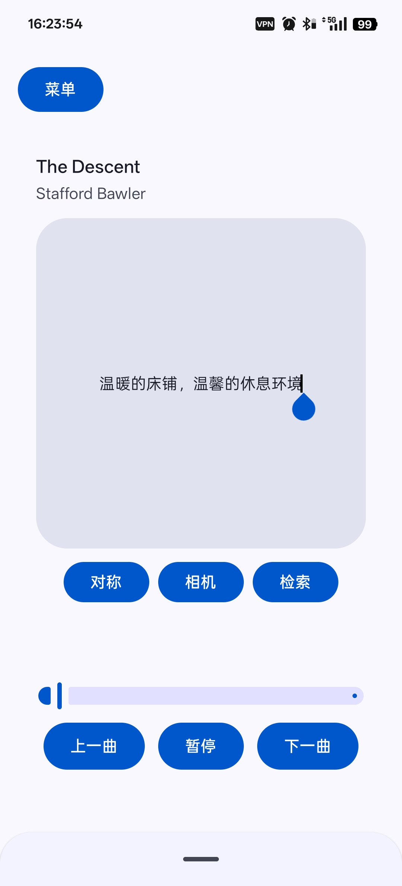

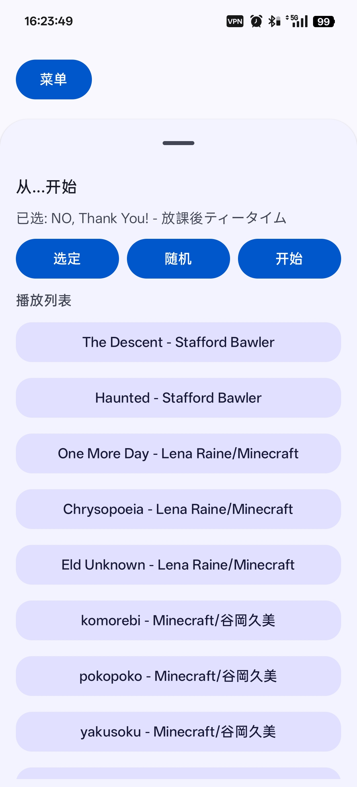

聆听对应的搜索结果（节选）：

（为了规避版权提供流媒体平台的播放链接）

[The Descent - Stafford Bawler](https://music.163.com/#/song?id=28855558)  
[Haunted - Stafford Bawler](https://music.163.com/#/song?id=426881208)  
[One More Day - Lena Raine/Minecraft](https://music.163.com/#/song?id=1887199302)  
[Chrysopoeia - Lena Raine/Minecraft](https://music.163.com/#/song?id=1454344539)
[Eld Unknown - Lena Raine/Minecraft](https://music.163.com/#/song?id=2145324212)
[komorebi - Minecraft/谷岡久美](https://music.163.com/#/song?id=2145324209)
[pokopoko -Minecraft/谷岡久美](https://music.163.com/#/song?id=2145324210)
[yakusoku - Minecraft/谷岡久美](https://music.163.com/#/song?id=2145324211)

[了解作为示例的音乐库](docs/musicLib.md)

### 更好的随机播放
> 以特定音乐为起点的随机播放，聆听风格近似的音乐。

#### **示例1**

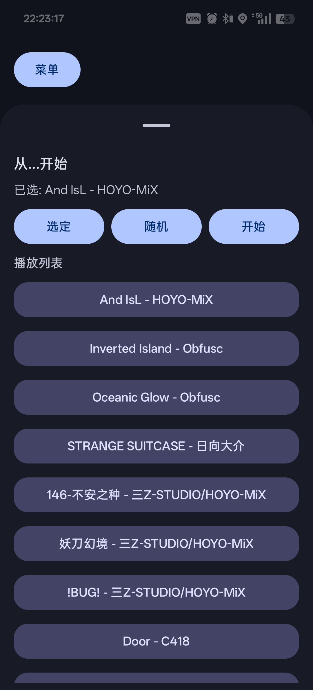

聆听对应的搜索结果（节选）：

（为了规避版权提供流媒体平台的播放链接）

#起始音乐：[Ans IsL - HOYO-MiX](https://music.163.com/#/song?id=1920737988)  

[Inverted Island - Obfusc](https://music.163.com/#/song?id=28855562)  
[Oceanic Glow - Obfusc](https://music.163.com/#/song?id=28855563)  
[STRANGE SUITCASE - 日向大介](https://music.163.com/#/song?id=480675)  
[不安之种 - 三Z-STUDIO/HOYO-MiX](https://music.163.com/#/song?id=2658039441)  
[妖刀幻境-三Z-STUDIO/HOYO-MiX](https://music.163.com/#/song?id=2658039040)  
[!BUG!-三Z STUDIO/HOYO-MiX](https://music.163.com/#/song?id=2658039017)  
[Door - C418](https://music.163.com/#/song?id=4010184)  
[Blind Spots - C418](https://music.163.com/#/song?id=27961150)  
[Mall - C418](https://music.163.com/#/song?id=27961173)
[Moog City 2 - C418](https://music.163.com/#/song?id=27961152)

[了解作为示例的音乐库](docs/musicLib.md)

#### **示例2**

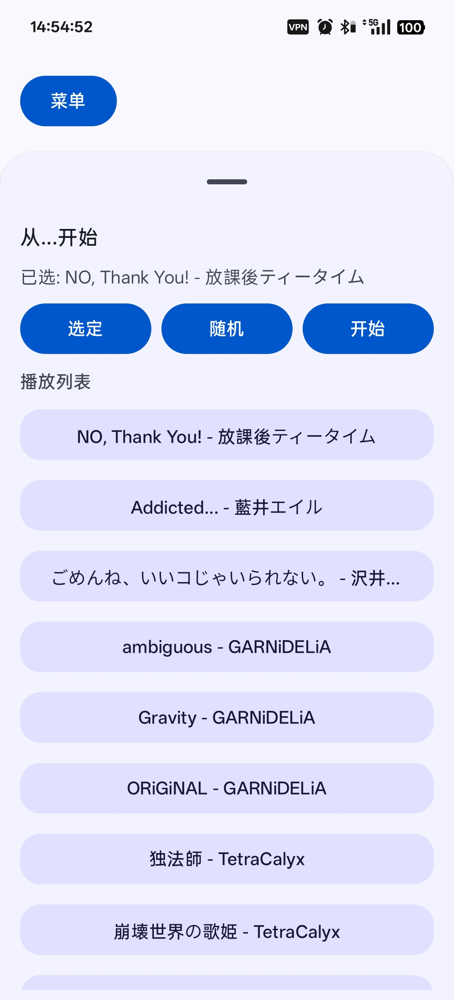

聆听对应的搜索结果（节选）：

（为了规避版权提供流媒体平台的播放链接）

#起始音乐：[NO, Thank You! - 放課後ティータイム](https://music.163.com/#/song?id=1317233324)  

[Addicted... - 藍井エイル](https://music.163.com/#/song?id=27969039)   
[ごめんね、いいコじゃいられない。 - 沢井美空](https://music.163.com/#/song?id=27902540)  
[ambiguous GARNiDELiA](https://music.163.com/#/song?id=1347688545)  
[Gravity - GARNiDELiA](https://music.163.com/#/song?id=1347687847)  
[ORiGiNAL-GARNiDELiA](https://music.163.com/#/song?id=1347688546)  
[独法師 - TetraCalyx](https://music.163.com/#/song?id=468513224)  
[崩壊世界の歌姫 - TetraCalyx](https://music.163.com/#/song?id=468513218)  

[了解作为示例的音乐库](docs/musicLib.md)
  

_________________________________________________________________________________________

## 使用方法

### 添加路径并且扫描

> #现有的扫描算法真的有些慢

打开菜单进入扫描界面

添加你的音乐库路径，点击扫描即可

### 添加 Gemini API Key

> #只能使用Gemini API Key，免费层级的额度也很可用

打开菜单进入API界面

点击“添加API”，输入你的 Gemini API Key，名字随便写，点击保存即可

### 进行向量生成并入库处理

> #使用了危险的transfomer在主线程并发处理音频切片，不过我用着还挺稳，所以没有改。  
> 
> #此功能需要调用 Gemini API，确保你当前的网络环境能够访问谷歌服务器
> 
> #我写了多API轮换的功能，但是好像用不了。你可以手动删除API来解决它，反正单api 1000次的额度也很够用了。

打开菜单进入数据库界面

在此界面你可以看到数据库内音乐的简陋信息。点击“开始”按钮，程序会自动开始对音乐进行切片，生成向量并入库。根据你的音乐库大小，这个过程可能需要一些时间。

### 在开始界面对称检索

进入开始界面，令左侧的模式选择按钮切换到“对称”。

此时点击中间的专辑显示区域可以唤起搜索框，在输入框内描述你想听的音乐的氛围，类型，感觉等。然后点击检索按钮即可获得推荐的音乐列表。

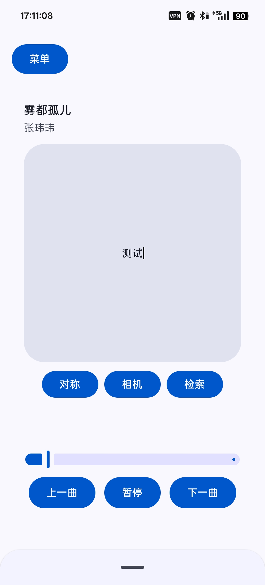

### 在播放列表抽屉里面选定一首歌曲开始漫游

进入开始界面，拖拽或点击抽屉的把手以拉出播放列表抽屉。

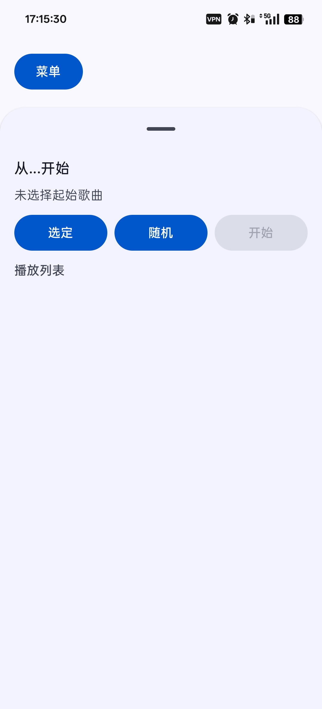

有两种方式来决定以什么音乐作为起点来进行漫游：

点击选定按钮会唤起搜索框，在此处输入你想听的音乐的名字并且点击就可以选中它。

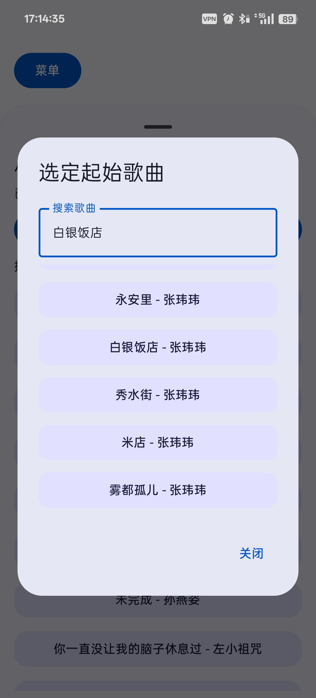

或是点击随机按钮，此时会随机选定一首音乐作为起点。

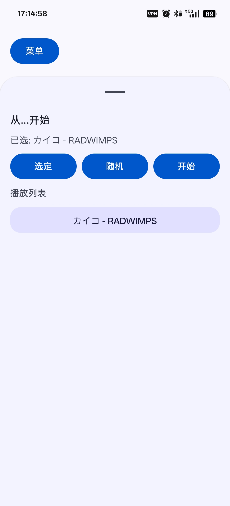

点击开始后被选定的歌曲会作为起点，生成与它风格相似的音乐列表。

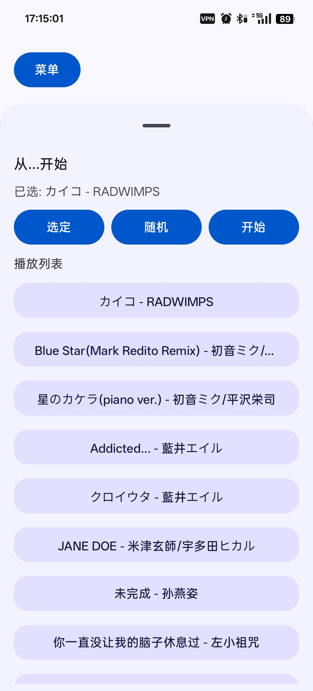

__________________________________________________________________________________________

## 它如何工作？

原理很简单，只是把音乐的音质降一降裁成80秒的片段，然后整个丢给Gemini Embedding 2生成向量，然后存到 [ObjectBox](https://github.com/objectbox) 数据库里。等你想要的时候就拿文本或者什么玩意儿来生成一个向量，拿这玩意搜一搜，功能很简单。

__________________________________________________________________________________________

## 它适合什么样的人？
如果你有一个庞大而且种类繁多的本地音乐库，并且想要在Android平台上拥有智能的播放体验，那么这个软件可能能为你带来一些新思路。

它可以帮助你更轻松地找到适合当前氛围的音乐，或者在随机播放时保持风格的一致性，也许吧。实际上我到现在也不确认这个技术方向的可行性，为什么没有人做过类似的东西呢？

如果你想要更传统的本地音乐播放体验，诚意推荐 [Salt Player](https://github.com/Moriafly/SaltPlayerSource)，世界上最好的本地音乐播放器。

__________________________________________________________________________________________

## 对此有兴趣？
如果你觉得这个方向有意思，你可以反馈Bug或者提出功能建议，或者加入开发。或者只是点个星标或者下载，让我知道这世上还有第二个人对这个想法感兴趣。这会给我很大的动力。

__________________________________________________________________________________________

## 免责声明

软件内API的储存是加密的，且仅与谷歌服务器通讯，但是对于API的使用作者不确保安全性，请自己保管好API密钥并且管理限额方案。  

该项目所依赖的 Gemini Embedding 2 模型处于预览阶段，随时有可能下线或者发生变动，请不要将它应用到生产环境中，也不要指望该软件能够一直正常使用。使用时也应遵守谷歌的服务条款和使用政策。

该软件算上作者吃喝玩乐的时间满打满算只花了两周时间构建，且作者缺乏一切和安全性，音乐品味，安卓开发，编程，系统设计，开源社区的所有基础知识，总之这是个快速原型，或者说一个玩具，怎么样都行。不保证代码的质量和软件稳定性，也不保证功能和逻辑的完备。

## 用于辅助检索的关键词： 

音乐
音乐推荐
Gemini Embedding 2
本地音乐
音乐播放
本地音乐播放
Embedding
音频检索
音乐库
