# Canned-Emotions - 鍚偣浠€涔?
**濡傛灉浣犳槸鐪嬩簡瑙嗛鏉ョ殑锛屾柊鐨凴EADME杩樻病鍐欏ソ锛屽緱杩囦釜涓や笁澶╋紝浣犲厛鍑戝悎鐫€鐢ㄧ敤鍚?(If you came here from the video, the new README is not ready yet. It will take a few more days, so please make do with this for now.)**

> 浠?Gemini Embedding 2 涓烘牳蹇冪殑 Android 鏈湴闊充箰鏅鸿兘鎾斁宸ュ叿銆?> A smart local music playing tool powered by Gemini Embedding 2.

Language: [绠€浣撲腑鏂嘳(README.md)  [English](docs/README_en.md)

Do you, just like me, own a massive and diverse local music library but sometimes struggle to find the "right" song? Or your player's random shuffle algorithm jumps from hard rock to gentle classical music?

This app would -- partly, improve your playing experience, making it smother, more context-aware, and more matched with your mood.

**Download [GitHub Release](https://github.com/bbblllllocck/Canned-Emotions/releases)**

I spent nearly two weeks to build this prototype after seeing the release of Gemini Embedding 2, to get a smarter music playing ability by using multimodal AI to generate vectors for your audio files.

And based on my (limited) understanding of AI and music playback, I鈥檝e designed two primary ways to interact with your library:

________________________________________________________________________________________

## Examples

### Better Random Play
> Random Shuffle (maybe not that random) with a specific music as a starting point, to hear the musics with simular style
>
> seriously, this is what really useful.
#### **Example 1**

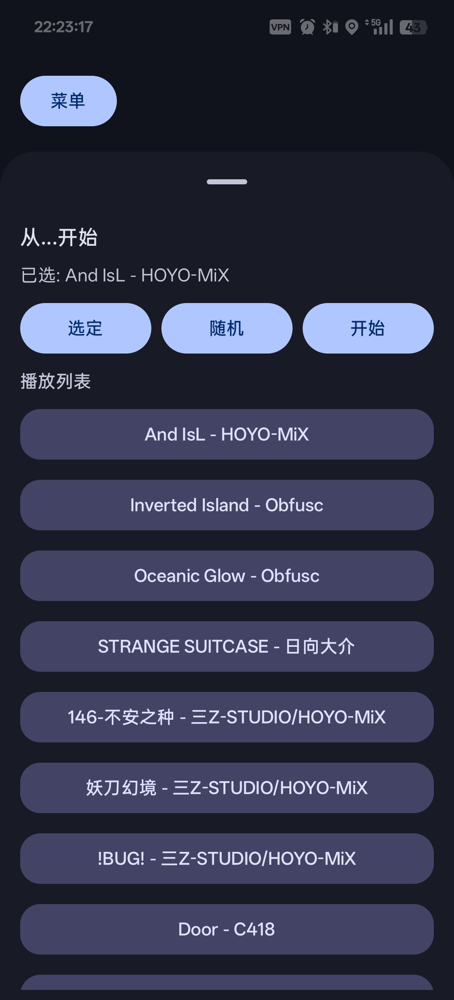

Listen To The Search Results (Snippets):

(Streaming links provided to avoid copyright issues)

#Starting point锛歔Ans IsL - HOYO-MiX](https://music.163.com/#/song?id=1920737988)

[Inverted Island - Obfusc](https://music.163.com/#/song?id=28855562)  
[Oceanic Glow - Obfusc](https://music.163.com/#/song?id=28855563)  
[STRANGE SUITCASE - 鏃ュ悜澶т粙](https://music.163.com/#/song?id=480675)  
[涓嶅畨涔嬬 - 涓塟-STUDIO/HOYO-MiX](https://music.163.com/#/song?id=2658039441)  
[濡栧垁骞诲-涓塟-STUDIO/HOYO-MiX](https://music.163.com/#/song?id=2658039040)  
[!BUG!-涓塟 STUDIO/HOYO-MiX](https://music.163.com/#/song?id=2658039017)  
[Door - C418](https://music.163.com/#/song?id=4010184)  
[Blind Spots - C418](https://music.163.com/#/song?id=27961150)  
[Mall - C418](https://music.163.com/#/song?id=27961173)
[Moog City 2 - C418](https://music.163.com/#/song?id=27961152)

[Learn the Example Music Library](docs/musicLib.md)

#### **Example 2**

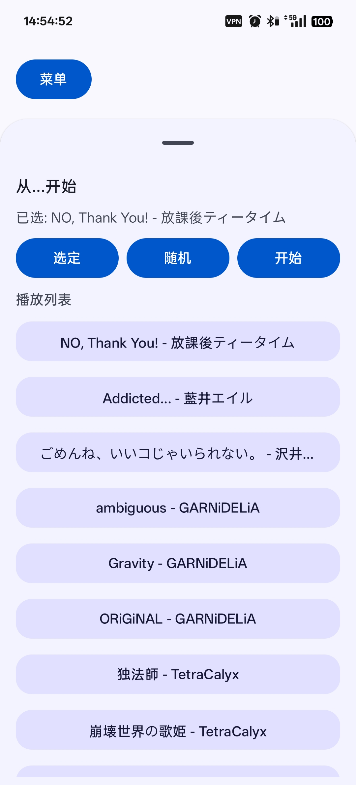

Listen To The Search Results (Snippets):

(Streaming links provided to avoid copyright issues)

#璧峰闊充箰锛歔NO, Thank You! - 鏀捐寰屻儐銈ｃ兗銈裤偆銉燷(https://music.163.com/#/song?id=1317233324)

[Addicted... - 钘嶄簳銈ㄣ偆銉玗(https://music.163.com/#/song?id=27969039)   
[銇斻倎銈撱伃銆併亜銇勩偝銇樸們銇勩倝銈屻仾銇勩€?- 娌簳缇庣┖](https://music.163.com/#/song?id=27902540)  
[ambiguous GARNiDELiA](https://music.163.com/#/song?id=1347688545)
[Gravity - GARNiDELiA](https://music.163.com/#/song?id=1347687847)  
[ORiGiNAL-GARNiDELiA](https://music.163.com/#/song?id=1347688546)
[鐙硶甯?- TetraCalyx](https://music.163.com/#/song?id=468513224)  
[宕╁涓栫晫銇瓕濮?- TetraCalyx](https://music.163.com/#/song?id=468513218)

[Learn the Example Music Library](docs/musicLib.md)

### Semantic Search The Music That Matches the Vibe

> Describe the current vibe, music type, feelings, to search the suitable music.

#### **Example 1**

Search Query:
Upbeat Pop-Rock, 124 BPM. Full pop guitar strumming with crisp drum beats. Reflecting the bright feeling of sunlight on a desk and a driven, productive workflow.

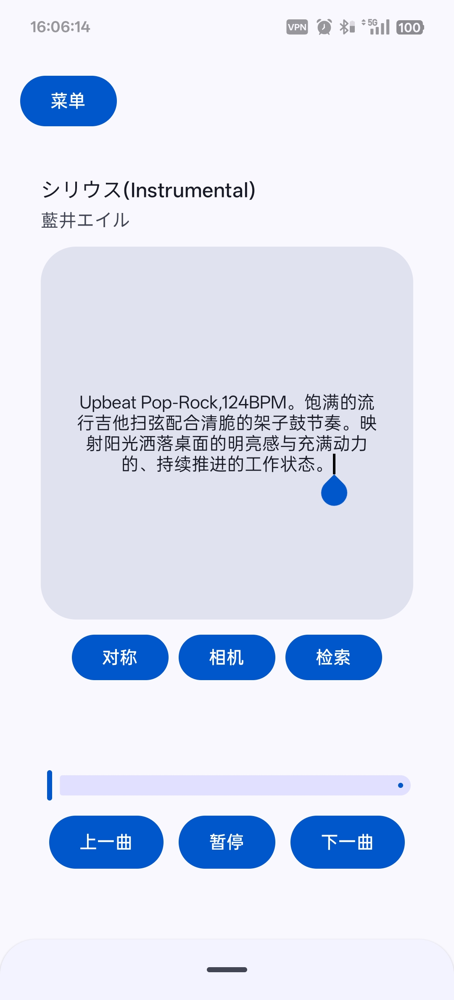

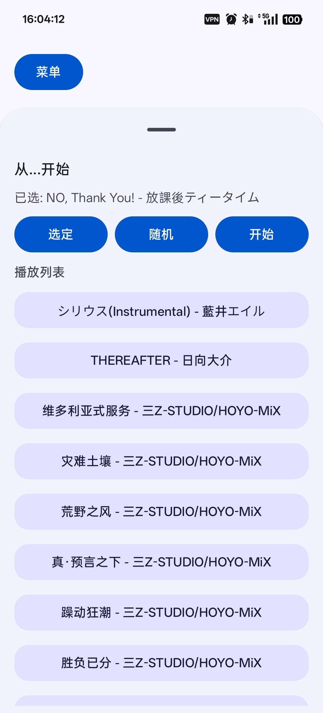

Listen To The Search Results (Snippets):

(Streaming links provided to avoid copyright issues)

[銈枫儶銈︺偣(Instrumental) - 钘嶄簳銈ㄣ偆銉玗(https://music.163.com/#/song?id=27969040)  
[THEREAFTER - 鏃ュ悜澶т粙](https://music.163.com/#/song?id=480654)  
[缁村鍒╀簹寮忔湇鍔?- 涓塟-STUDIO/HOYO-MiX](https://music.163.com/#/song?id=2657833383)   
[鐏鹃毦鍦熷￥ - 涓塟-STUDIO/HOYO-MiX](https://music.163.com/#/song?id=2657833393)  
[鑽掗噹涔嬮 - 涓塟-STUDIO/HOYO-MiX](https://music.163.com/#/song?id=2657830928)  
[鐪熉烽瑷€涔嬩笅 - 涓塟-STUDIO/HOYO-MiX](https://music.163.com/#/song?id=2657830947)  
[韬佸姩鐙傛疆 - 涓塟-STUDIO/HOYO-MiX](https://music.163.com/#/song?id=2658039024)  
[鑳滆礋宸插垎 - 涓塟-STUDIO/HOYO-MiX](https://music.163.com/#/song?id=2658039013)

[Learn the Example Music Library](docs/musicLib.md)

#### **Example 2**

Example 2
Search Query: Warm blankets, cozy and peaceful resting environment.

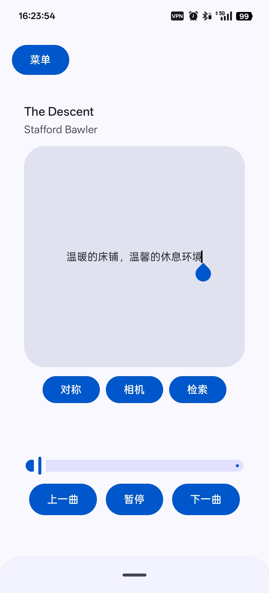

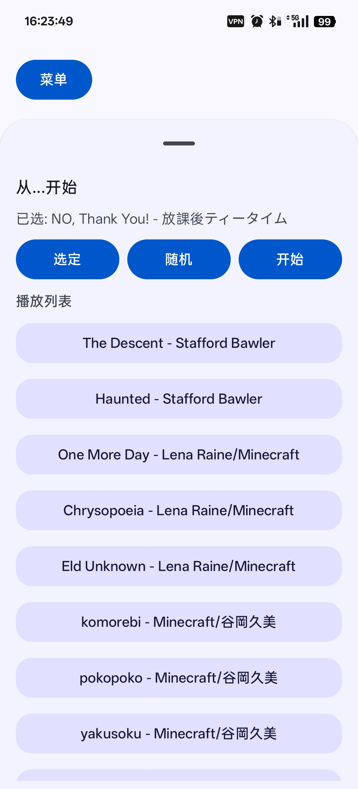

Listen To The Search Results (Snippets):

(Streaming links provided to avoid copyright issues)

[The Descent - Stafford Bawler](https://music.163.com/#/song?id=28855558)  
[Haunted - Stafford Bawler](https://music.163.com/#/song?id=426881208)  
[One More Day - Lena Raine/Minecraft](https://music.163.com/#/song?id=1887199302)  
[Chrysopoeia - Lena Raine/Minecraft](https://music.163.com/#/song?id=1454344539)
[Eld Unknown - Lena Raine/Minecraft](https://music.163.com/#/song?id=2145324212)
[komorebi - Minecraft/璋峰病涔呯編](https://music.163.com/#/song?id=2145324209)
[pokopoko -Minecraft/璋峰病涔呯編](https://music.163.com/#/song?id=2145324210)
[yakusoku - Minecraft/璋峰病涔呯編](https://music.163.com/#/song?id=2145324211)

[Learn the Example Music Library](docs/musicLib.md)

_________________________________________________________________________________________

## How to Use

### Add Path & Scan

> #The current scanning algorithm is really f**king slow.

Enter "鎵弿" page from menu "鑿滃崟"

Add your local music library path in the "鎵弿" interface and click "寮€濮嬫壂鎻?.

### Add Gemini API Key

>> #This app is powered by Gemini API Key. Get it on [Google AI Studio](https://aistudio.google.com/app/apikey) for free. (Make sure your network environment meets Google's requirements).
>
> #Requires a Gemini API Key. The free tier quota is usually enough.

Enter "API" page from menu "鑿滃崟"

Click"娣诲姞API"锛宔nter your Gemini API Key锛宑lick"淇濆瓨".

### Vector Generation & Database Indexing

> #the transfomer lib I use might blocking the main scope, um why I don't just fix it and avoid saying it in readme?
>
> #This function requires using Gemini API锛宮ake sure it's available in your current network environment.
>
> #I wrote multi-API rotation, but it may not work well now. If needed, remove the first 1 or 2 API manually and that may help. 

Open the menu and enter the `鏁版嵁搴揱 page.

On this page, you can see basic music info in the database. Click `寮€濮媊, and the app will slice audio, generate vectors, and save them to the database. Depending on your library size, this may take some time.

### Symmetric Search on Start Page

Open the Start page, then switch the mode button on the left to `瀵圭О`.

Tap the center album area to open the search box. In the input box, describe the mood, style, and feeling you want to hear. Then tap `Search` to get a recommended playlist.

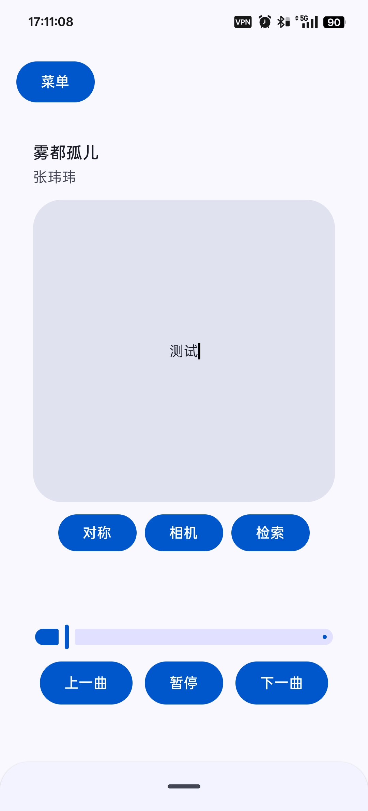

### Select One Song in Playlist Drawer to Start Roaming

Open the Start page, then drag up or tap the drawer handle to open the playlist drawer.

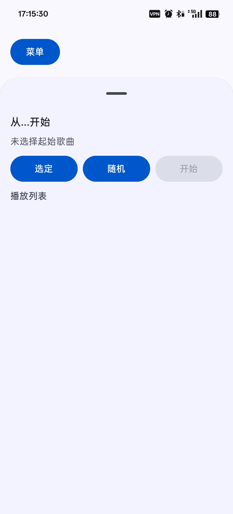

There are two ways to choose the start song for roaming:

Tap `閫夊畾` to open a search box. Enter the song name you want, then tap one result to select it.

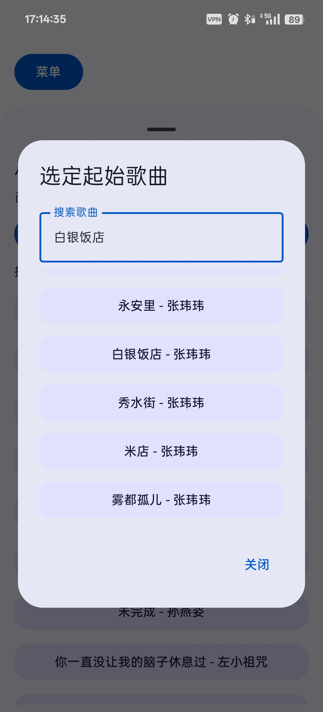

Or tap `闅忔満` to pick one song as the starting point.

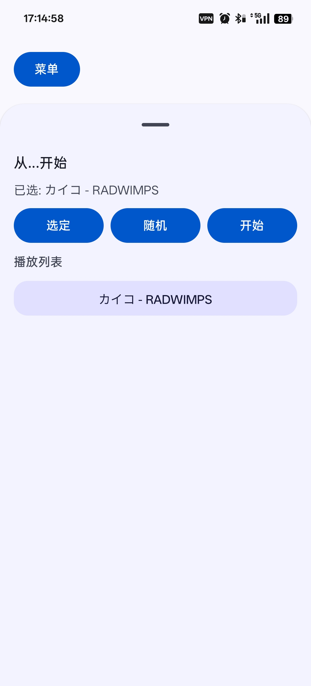

After that, tap `寮€濮媊. The selected song will be used as the seed, and the app will generate a playlist with similar style.

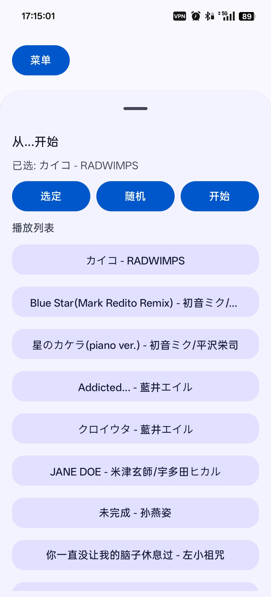

__________________________________________________________________________________________

## How It Works

The idea is simple: lower the audio quality a little, cut songs into 80-second chunks, send them to Gemini Embedding 2 to get vectors, and store vectors in [ObjectBox](https://github.com/objectbox). When you want music, generate a vector from text (or another input), then search for similar vectors.

__________________________________________________________________________________________

## Who Is It For?
If you have a large and diverse local music library, and you want a smarter playback experience on Android, this app may give you a new idea.

It can help you find songs that match your current mood, or keep random play more style-consistent. Maybe. To be honest, I am still not fully sure how practical this direction is.

If you prefer a more traditional local music player experience, I sincerely recommend [Salt Player](https://github.com/Moriafly/SaltPlayerSource), the best local music player in this world.

__________________________________________________________________________________________

## Interested?
If this direction sounds interesting to you, feel free to report bugs, suggest features, or join development. Or just star the repo or download it, so I know there is at least one more person who likes this idea.

__________________________________________________________________________________________

## Disclaimer

API keys in the app are stored in encrypted form and only communicate with Google servers, but I cannot guarantee full security. Please keep your API keys safe and manage your quota plan yourself.

The Gemini Embedding 2 model used by this project is in preview, and it may change or go offline at any time. Do not use this project in production, and do not assume it will always work. Please also follow Google's terms and usage policies.

This software took about two weeks to build (including eating, resting, and messing around). I also lack almost every kind of formal knowledge in security, music taste, Android development, programming, system design, and open-source community practices. In short, this is a fast prototype, or just a toy. No guarantee for code quality, software stability, or complete logic.

## Keywords for Search

music
music recommendation
Gemini Embedding 2
local music
music playback
local music playback
Embedding
audio retrieval
music library
