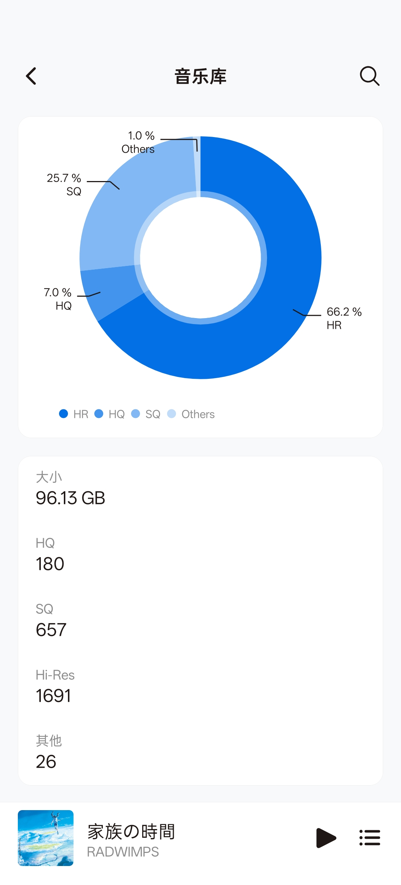
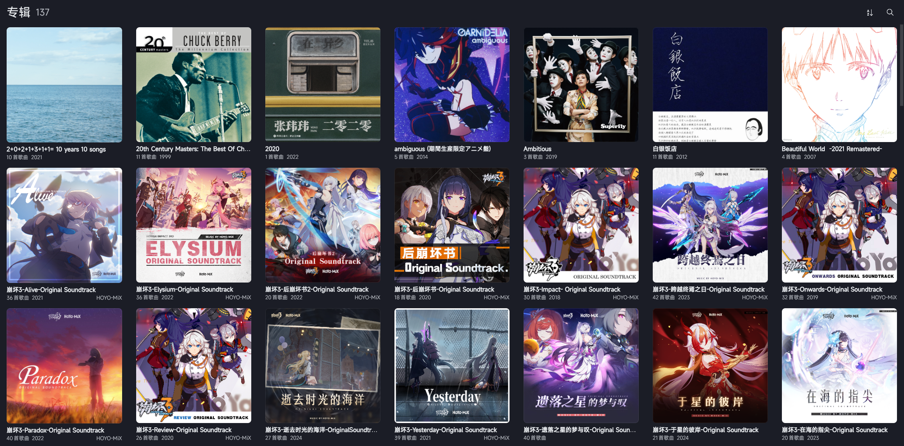
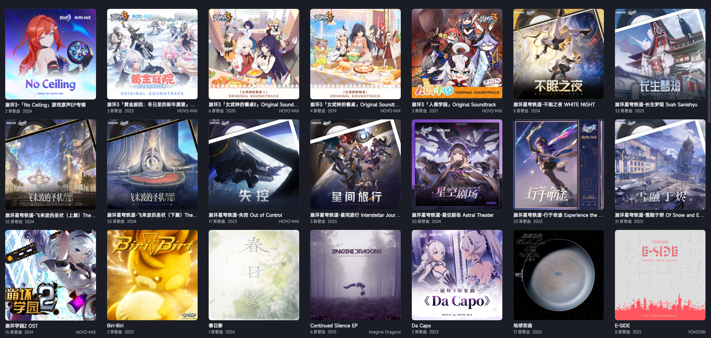
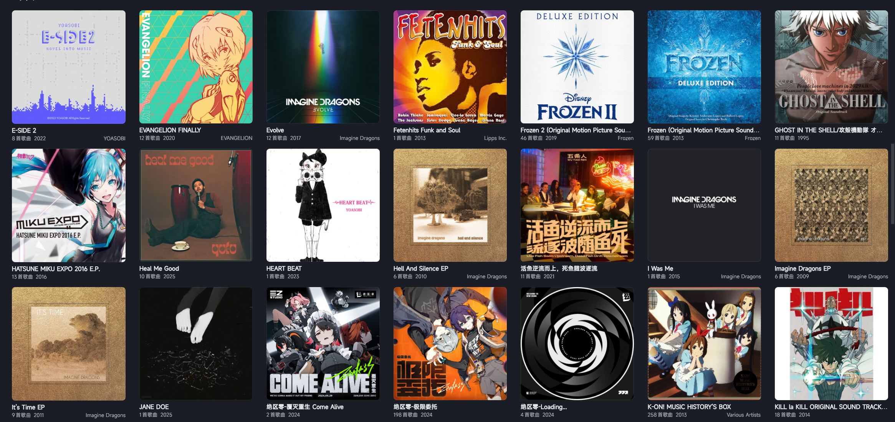
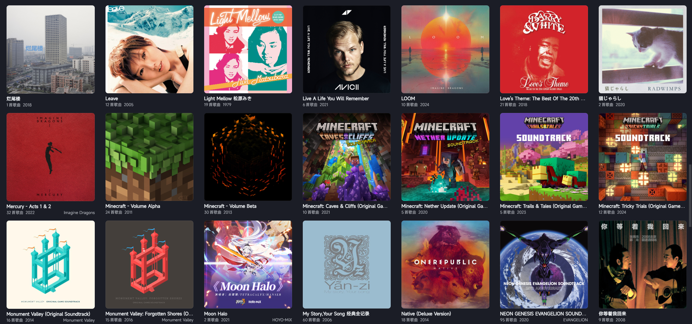
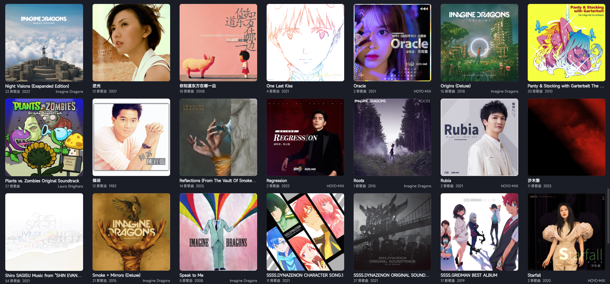
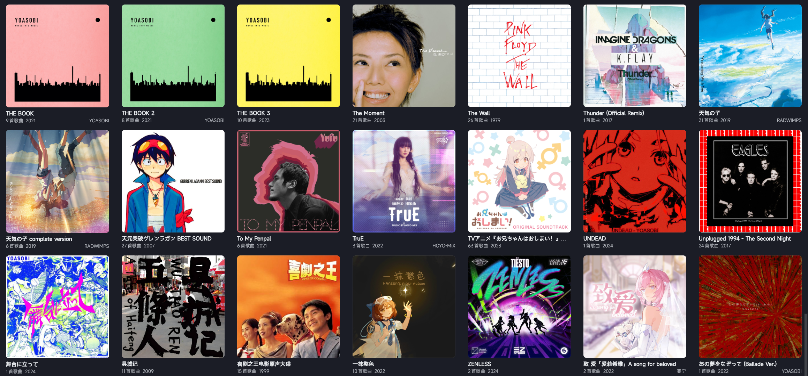
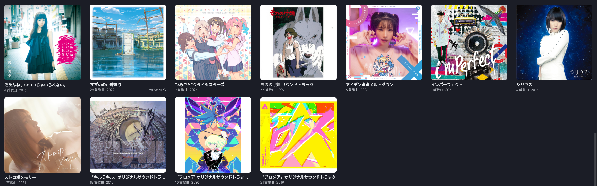

音乐的数量统计



所有专辑

  
  
  
  
  
  
  

> 截图来自SaltPlayer

文件目录

```
├─Aaron Cherof,Minecraft
│  └─Minecraft Trails & Tales (Original Game Soundtrack)
│          Aaron Cherof & Minecraft - A Familiar Room.flac
│          Aaron Cherof & Minecraft - Bromeliad.flac
│          Aaron Cherof & Minecraft - Crescent Dunes.flac
│          Aaron Cherof & Minecraft - Echo in the Wind.flac
│          Aaron Cherof & Minecraft - Relic.flac
│
├─Avicii
│  └─Live A Life You Will Remember
│          Hey Brother.flac
│          I Could Be The One (Avicii Vs. Nicky Romero) (Radio Edit).flac
│          Levels (Radio Edit).flac
│          The Nights.flac
│          Waiting For Love.flac
│          Wake Me Up (Radio Edit).flac
│
├─Barry White
│  └─Love's Theme The Best Of The 20th Century Records Singles
│          Barry White & Gene Page - I'll Do For You Anything You Want Me To (Single Version).flac
│          Barry White - Baby We Better Try To Get It Together.flac
│          Barry White - Can't Get Enough Of Your Love, Babe.flac
│          Barry White - Don't Make Me Wait Too Long.flac
│          Barry White - Honey Please, Can't Ya See (Alternate Version).flac
│          Barry White - I Love To Sing The Songs I Sing.flac
│          Barry White - I'm Gonna Love You Just A Little More Baby (Single Version).flac
│          Barry White - I'm Qualified To Satisfy You (Single Version).flac
│          Barry White - I've Got So Much To Give (Single Version).flac
│          Barry White - It's Ecstasy When You Lay Down Next To Me (Single Version).flac
│          Barry White - Just The Way You Are (Single Version).flac
│          Barry White - Let The Music Play (Single Version).flac
│          Barry White - Never, Never Gonna Give Ya Up (Single Version).flac
│          Barry White - Oh What A Night For Dancing (Edit).flac
│          Barry White - Playing Your Game, Baby (Single Version).flac
│          Barry White - September When I First Met You (Single Version).flac
│          Barry White - What Am I Gonna Do With You.flac
│          Barry White - You See The Trouble With Me (Single Version).flac
│          Barry White - You're The First, The Last, My Everything (Single Version).flac
│          Barry White - Your Sweetness Is My Weakness (Single Version).flac
│          The Love Unlimited Orchestra - Love's Theme (Single Version).flac
│
├─C418
│  ├─Minecraft - Volume Alpha
│  │      C418 - Beginning.flac
│  │      C418 - Cat.flac
│  │      C418 - Chris.flac
│  │      C418 - Clark.flac
│  │      C418 - Danny.flac
│  │      C418 - Death.flac
│  │      C418 - Dog.flac
│  │      C418 - Door.flac
│  │      C418 - Droopy Likes Ricochet.flac
│  │      C418 - Droopy Likes Your Face.flac
│  │      C418 - Dry Hands.flac
│  │      C418 - Excuse.flac
│  │      C418 - Haggstrom.flac
│  │      C418 - Key.flac
│  │      C418 - Living Mice.flac
│  │      C418 - Mice on Venus.flac
│  │      C418 - Minecraft.flac
│  │      C418 - Moog City.flac
│  │      C418 - Oxygène.flac
│  │      C418 - Subwoofer Lullaby.flac
│  │      C418 - Sweden.flac
│  │      C418 - Thirteen.flac
│  │      C418 - Wet Hands.flac
│  │      C418 - Équinoxe.flac
│  │
│  └─Minecraft - Volume Beta
│          C418 - Alpha.flac
│          C418 - Aria Math.flac
│          C418 - Ballad of the Cats.flac
│          C418 - Beginning 2.flac
│          C418 - Biome Fest.flac
│          C418 - Blind Spots.flac
│          C418 - Blocks.flac
│          C418 - Chirp.flac
│          C418 - Concrete Halls.flac
│          C418 - Dead Voxel.flac
│          C418 - Dreiton.flac
│          C418 - Eleven.flac
│          C418 - Far.flac
│          C418 - Flake.flac
│          C418 - Floating Trees.flac
│          C418 - Haunt Muskie.flac
│          C418 - Intro.flac
│          C418 - Ki.flac
│          C418 - Kyoto.flac
│          C418 - Mall.flac
│          C418 - Mellohi.flac
│          C418 - Moog City 2.flac
│          C418 - Mutation.flac
│          C418 - Stal.flac
│          C418 - Strad.flac
│          C418 - Taswell.flac
│          C418 - The End.flac
│          C418 - Wait.flac
│          C418 - Ward.flac
│          C418 - Warmth.flac
│
├─Chuck Berry
│  └─20th Century Masters The Best Of Chuck Berry - The Millennium Collection
│          Brown Eyed Handsome Man (Single Version).flac
│          Carol (Single Version).flac
│          Johnny B. Goode.flac
│          Maybellene (Single Version).flac
│          My Ding-A-Ling (Live At Lanchester Arts Festival,1972).flac
│          No Particular Place To Go (Single Version).flac
│          Rock And Roll Music (1958 Single Version).flac
│          Roll Over Beethoven (Single Version).flac
│          School Day (Ring Ring Goes The Bell) (Single Version).flac
│          Sweet Little Sixteen.flac
│          You Never Can Tell (1964 Single Version).flac
│
├─CRYCHIC
│  └─春日影
│          春日影.flac
│
├─Eagles
│      Best Of My Love.flac
│      Desperado.flac
│      Get Over It.flac
│      Heartache Tonight.flac
│      Help Me Thru The Night.flac
│      Hotel California.flac
│      I Can't Tell You Why.flac
│      In The City.flac
│      Introductions.flac
│      Learn To Be Still.flac
│      Life In The Fast Lane.flac
│      Love Will Keep Us Alive.flac
│      Lover's Moon.flac
│      New York Minute.flac
│      One Of These Nights.flac
│      Peaceful Easy Feeling.flac
│      Pretty Maids All In A Row.flac
│      Take It Easy.flac
│      Tequila Sunrise.flac
│      The Girl From Yesterday.flac
│      The Heart Of The Matter.flac
│      The Last Resort.flac
│      Wasted Time (Reprise).flac
│      Wasted Time.flac
│
├─EVANGELION
│  ├─Beautiful World  -2021 Remastered-
│  │      Beautiful World (2021 Remastered).flac
│  │      Beautiful World (PLANiTb Acoustica Mix ／ 2021 Remastered).mp3
│  │      Fly Me To The Moon (In Other Words) (2007 MIX ／ 2021 Remastered).mp3
│  │      桜流し (2021 Remastered).mp3
│  │
│  ├─EVANGELION FINALLY
│  │      Come sweet death,second impact.flac
│  │      Dilemmatic triangle opera (AYANAMI Version).flac
│  │      Dilemmatic triangle opera.flac
│  │      Komm, süsser Tod ／甘き死よ、来たれ (M-10 Director’s Edit. Version).flac
│  │      THANATOS -IF I CAN’T BE YOURS-.flac
│  │      The Image of black me.flac
│  │      今日の日はさようなら.flac
│  │      幸せは罪の匂い.flac
│  │      心よ原始に戻れ 2020.flac
│  │      残酷な天使のテーゼ.flac
│  │      無限抱擁.flac
│  │      魂のルフラン.flac
│  │
│  ├─NEON GENESIS EVANGELION SOUNDTRACK 25th ANNIVERSARY BOX
│  │      A Crystalline Night Sky.flac
│  │      A Moment When Tension Breaks.flac
│  │      A STEP FORWARD INTO TERROR.flac
│  │      ANGEL ATTACK Ⅱ.flac
│  │      ANGEL ATTACK Ⅲ.flac
│  │      ANGEL ATTACK.flac
│  │      ASUKA STRIKES!.flac
│  │      B16(MISATO).flac
│  │      B17(ASUKA STRIKES).flac
│  │      BACKGROUND MUSIC Ⅱ.flac
│  │      BACKGROUND MUSIC Ⅲ.flac
│  │      BACKGROUND MUSIC.flac
│  │      BAREFOOT IN THE PARK.flac
│  │      BORDERLINE CASE.flac
│  │      Both of you, Dance Like You Want to Win!.flac
│  │      CHILDHOOD MEMORIES, SHUT AWAY.flac
│  │      Choeur： Jésus demeure ma joie, Consolation et sève de mon coeur.flac
│  │      CRIME OF INNOCENCE.flac
│  │      DECISIVE BATTLE.flac
│  │      DEPRESSION.flac
│  │      Do you love me？.flac
│  │      DVOŘÁK ： Original Complete Version.flac
│  │      EVA-00.flac
│  │      EVA-01.flac
│  │      EVA-02.flac
│  │      F02 version 0706.flac
│  │      Good, or Don't Be.flac
│  │      HARBINGER OF TRAGEDY.flac
│  │      Hedgehog's Dilemma.flac
│  │      HOLTILITY RESTRAINED.flac
│  │      I.SHINJI.flac
│  │      II Air [ORCHESTRAL SUITE No.3 in D Major, BWV. 1068].flac
│  │      IN THE DEPTHS OF HUMAN HEARTS.flac
│  │      INFANTILE DEPENDENCE, ADULT DEPENDENCY.flac
│  │      INTROJECTION.flac
│  │      Jesus bleibet meine Freude Herz und Mund und Tat und Leben BWV.147／主よ、人の望みのみの喜びよ.flac
│  │      Kanon D dur (Qurtet).flac
│  │      Kanon D dur (Strings Orchestra).flac
│  │      Komm, süsser Tod／甘き死よ、来たれ (M 10 Director's Edit. Version).flac
│  │      M9 (閉塞の拡大オリジナル版).flac
│  │      MAGMADIVER.flac
│  │      MARKING TIME,WAITNG FOR DEATH.flac
│  │      MISATO.flac
│  │      MOTHER IS THE FIRST OTHER.flac
│  │      NERV.flac
│  │      NORMAL BLOOD.flac
│  │      Partita III für Violino solo E dur , BWV. 1006 3. Gavotte in Rondo.flac
│  │      PLEASURE PRINCIPLE.flac
│  │      Rei I.flac
│  │      Rei II.flac
│  │      Rei III.flac
│  │      RITSUKO.flac
│  │      SEPARATION ANXIETY.flac
│  │      She said,＂Don't make others suffer for your personal hatred.＂.flac
│  │      Spending Time in Preparation.flac
│  │      Splitting of the Breast.flac
│  │      Suiten für Violoncello solo Nr.1 G dur , BWV. 1007 1. Vorspier.flac
│  │      THANATOS- IF I CAN'T BE YOURS-.flac
│  │      THANATOS.flac
│  │      THE BEAST II.flac
│  │      THE BEAST.flac
│  │      The Day Tokyo-3 Stood Still(B-14).flac
│  │      THE HEADY FEELING OF FREEDOM.flac
│  │      THREE OF ME, ONE OF SOMEONE ELSE.flac
│  │      TOKYO.flac
│  │      Waking up in the morning.flac
│  │      When I Find Peace of Mind.flac
│  │      チェロ ― 第四弦 調弦.flac
│  │      ヴァイオリン ― 第二弦 調弦.flac
│  │      ヴィオラ ― 第三弦 調弦.flac
│  │      不安との蜜月.flac
│  │      予感.flac
│  │      他人の干渉.flac
│  │      偽りの、再生 (1).flac
│  │      偽りの、再生.flac
│  │      優しさの代理.flac
│  │      吾への、涙.flac
│  │      夢のスキマ.flac
│  │      始まりへの逃避.flac
│  │      幸せは罪の匂い.flac
│  │      未了への、調律.flac
│  │      次回予告 (F2 15秒バージョン).flac
│  │      次回予告（Fー2 30秒バージョン）.flac
│  │      残酷な天使のテーゼ ＜Director's Edit. Version II＞.flac
│  │      残酷な天使のテーゼ ＜Director's Edit.＞.flac
│  │      残酷な天使のテーゼ ＜TV. Size＞.flac
│  │      無限抱擁.flac
│  │      真夏の終演.flac
│  │      空しき流れ.flac
│  │      脆弱な、自我境界.flac
│  │      虚妄への、依存.flac
│  │      身代わりの侵入.flac
│  │      退行への緊急避難.flac
│  │      閉塞の拡大.flac
│  │      魂のルフラン.flac
│  │
│  ├─One Last Kiss
│  │      Beautiful World (Da Capo Version [Instrumental]).mp3
│  │      Beautiful World (Da Capo Version).mp3
│  │      One Last Kiss (Instrumental).mp3
│  │      One Last Kiss.flac
│  │
│  └─Shiro SAGISU Music from “SHIN EVANGELION＂
│          ave verum corpus.flac
│          berceuse： piano dans l’orchestre à cordes.flac
│          berceuse： piano.flac
│          born evil.flac
│          citation from ‘joy to the world’.flac
│          EM10A alterne bis.flac
│          EM10A alterne.flac
│          EM20 =wunder operation=.flac
│          euro nerv.flac
│          hand of fate.flac
│          hand of fate： playback.flac
│          if a cause is worth dying for then be.flac
│          i’ll go on loving someone else =version orchestre=.flac
│          karma.flac
│          killer.flac
│          la plus belle étoile.flac
│          lost in the memory.flac
│          lost in the memory： playback.flac
│          l’homme n’est ni ange ni bête.flac
│          m & r： piano.flac
│          m & r： suite pour piano, flûte basse et orchestre.flac
│          metamorphosis.flac
│          mirror mirror： orchestra and choir.flac
│          mirror mirror： refrain.flac
│          paranoia.flac
│          paris.flac
│          pensées intimes： piano dans l’orchestre à cordes.flac
│          pensées intimes： piano.flac
│          pillars of faith.flac
│          prettiest star.flac
│          psycho.flac
│          réminiscence： épilogue.flac
│          soul love： guitar to orchestra segue.flac
│          tema principale： chitarra.flac
│          tema principale： orchestra dedicata ai maestri.flac
│          tema principale： piano dedicata ai maestri.flac
│          tema principale： tromba e orchestra.flac
│          the path.flac
│          the way of life.flac
│          this is the dream, beyond belief.flac
│          this is the dream.flac
│          thème du concerto 494.flac
│          unwelcome： orchestra.flac
│          unwelcome： piano.flac
│          voices in my head.flac
│          VOYAGER～日付のない墓標 =suppa duppa bossa=.flac
│          VOYAGER～日付のない墓標.flac
│          what if？： guitar.flac
│          what if？： orchestra, choir and piano.flac
│          yearning for your love.flac
│          yearning for your love： playback.flac
│          激突!轟天対大魔艦 =hooked on the last train=.flac
│          激突!轟天対大魔艦.flac
│          ：ll.flac
│
├─Fetenhits Funk and Soul
│      Funkytown.flac
│
├─Frozen
│  ├─Frozen (Original Motion Picture Soundtrack ／ Deluxe Edition)
│  │      Cliff Diving (Score Demo).mp3
│  │      Conceal, Don't Feel (From ＂Frozen＂／Score).flac
│  │      Coronation Band Suite (Source Score).mp3
│  │      Coronation Day (From ＂Frozen＂／Score).flac
│  │      Do You Want to Build a Snowman？ (From ＂Frozen＂／Soundtrack Version).flac
│  │      Elsa and Anna (From ＂Frozen＂／Score).flac
│  │      Elsa Imprisoned (Score Demo).mp3
│  │      Epilogue (From ＂Frozen＂／Score).flac
│  │      Fixer Upper (From ＂Frozen＂／Soundtrack Version).flac
│  │      For the First Time in Forever (Demo).mp3
│  │      For the First Time in Forever (From ＂Frozen＂／Soundtrack Version).flac
│  │      For the First Time in Forever (Instrumental Karaoke).mp3
│  │      For the First Time in Forever (Reprise) (From ＂Frozen＂／Soundtrack Version).flac
│  │      Frozen Heart (From ＂Frozen＂／Soundtrack Version).flac
│  │      Hands for Hans (Score Demo).mp3
│  │      Hans (Score Demo).mp3
│  │      Hans' Kiss (Score Demo).mp3
│  │      Heimr Àrnadalr (From ＂Frozen＂／Score).flac
│  │      In Summer (From ＂Frozen＂／Soundtrack Version).flac
│  │      In Summer (Instrumental Karaoke).mp3
│  │      It Had to Be Snow (Score Demo).mp3
│  │      Let It Go (Demi Lovato Version ／ Instrumental Karaoke).mp3
│  │      Let It Go (From ＂Frozen ／ Single Version).flac
│  │      Let It Go (From ＂Frozen＂／Soundtrack Version).flac
│  │      Let It Go (Instrumental Karaoke).mp3
│  │      Life's Too Short (Outtake).mp3
│  │      Life's Too Short (Reprise) (Outtake).mp3
│  │      Love Is an Open Door (Demo).mp3
│  │      Love Is an Open Door (From ＂Frozen＂／Soundtrack Version).flac
│  │      Love Is an Open Door (Instrumental Karaoke).mp3
│  │      Marshmallow Attack! (From ＂Frozen＂／Score).flac
│  │      Meet Olaf (Score Demo).mp3
│  │      More Than Just the Spare (Outtake).mp3
│  │      Oaken's Sauna (Score Demo).mp3
│  │      Only An Act of True Love (From ＂Frozen＂／Score).flac
│  │      Onward and Upward (From ＂Frozen＂／Score).flac
│  │      Queen Elsa of Arendelle (Score Demo).mp3
│  │      Reindeer(s) Are Better Than People (From ＂Frozen＂ ／ Soundtrack Version).flac
│  │      Reindeer(s) Remix (Outtake).mp3
│  │      Return to Arendelle (From ＂Frozen＂／Score).flac
│  │      Royal Pursuit (From ＂Frozen＂／Score).flac
│  │      Some People Are Worth Melting For (From ＂Frozen＂／Score).flac
│  │      Sorcery (From ＂Frozen＂／Score).flac
│  │      Spring Pageant (Outtake).mp3
│  │      Summit Siege (From ＂Frozen＂／Score).flac
│  │      The Ballad of Olaf & Sven ((Teaser Trailer／Score Demo)).mp3
│  │      The Great Thaw (Vuelie Reprise) (From ＂Frozen＂／Score).flac
│  │      The Love Experts (Score Demo).mp3
│  │      The North Mountain (From ＂Frozen＂／Score).flac
│  │      The Trolls (From ＂Frozen＂／Score).flac
│  │      Thin Air (Score Demo).mp3
│  │      Treason (From ＂Frozen＂／Score).flac
│  │      Vuelie (From ＂Frozen＂／Score).flac
│  │      We Know Better (Outtake).mp3
│  │      We Were So Close (From ＂Frozen＂／Score).flac
│  │      Whiteout (From ＂Frozen＂／Score).flac
│  │      Winter's Waltz (From ＂Frozen＂／Score).flac
│  │      Wolves (From ＂Frozen＂／Score).flac
│  │      You're You (Outtake).mp3
│  │
│  └─Frozen 2 (Original Motion Picture Soundtrack／Deluxe Edition)
│          All Is Found (From ＂Frozen 2＂／Instrumental).flac
│          All Is Found (From ＂Frozen 2＂／Kacey Musgraves Version).flac
│          All Is Found (From ＂Frozen 2＂／Kacey Musgraves Version／Instrumental).flac
│          All Is Found (From ＂Frozen 2＂／Soundtrack Version).flac
│          All Is Found (Lullaby Ending) (From ＂Frozen 2＂／Outtake).flac
│          Dark Sea (From ＂Frozen 2＂／Score).flac
│          Earth Giants (From ＂Frozen 2＂／Score).flac
│          Epilogue (From ＂Frozen 2＂／Score).flac
│          Exodus (From ＂Frozen 2＂／Score).flac
│          Fire and Ice (From ＂Frozen 2＂／Score).flac
│          Get This Right (From ＂Frozen 2＂／Outtake).flac
│          Ghosts of Arendelle Past (From ＂Frozen 2＂／Score).flac
│          Gone Too Far (From ＂Frozen 2＂／Score).flac
│          Home (From ＂Frozen 2＂／Outtake).flac
│          I Seek the Truth (From ＂Frozen 2＂／Outtake).flac
│          Iduna's Scarf (From ＂Frozen 2＂／Score).flac
│          Into the Unknown (From ＂Frozen 2＂／Instrumental).flac
│          Into the Unknown (From ＂Frozen 2＂／Panic! At The Disco Version).flac
│          Into the Unknown (From ＂Frozen 2＂／Panic! At The Disco Version／Instrumental).flac
│          Into the Unknown (From ＂Frozen 2＂／Soundtrack Version).flac
│          Introduction (From ＂Frozen 2＂／Score).flac
│          Lost in the Woods (From ＂Frozen 2＂／Instrumental).flac
│          Lost in the Woods (From ＂Frozen 2＂／Soundtrack Version).flac
│          Lost in the Woods (From ＂Frozen 2＂／Weezer Version).flac
│          Lost in the Woods (From ＂Frozen 2＂／Weezer Version／Instrumental).flac
│          Reindeer Circle (From ＂Frozen 2＂／Score).flac
│          Reindeer(s) Are Better Than People (Cont.) (From ＂Frozen 2＂／Instrumental).flac
│          Reindeer(s) Are Better Than People (Cont.) (From ＂Frozen 2＂／Soundtrack Version).flac
│          Reunion (From ＂Frozen 2＂／Score).flac
│          River Slide (From ＂Frozen 2＂／Score).flac
│          Rude Awakening (From ＂Frozen 2＂／Score).flac
│          Show Yourself (From ＂Frozen 2＂／Instrumental).flac
│          Show Yourself (From ＂Frozen 2＂／Soundtrack Version).flac
│          Sisters (From ＂Frozen 2＂／Score).flac
│          Some Things Never Change (From ＂Frozen 2＂／Instrumental).flac
│          Some Things Never Change (From ＂Frozen 2＂／Soundtrack Version).flac
│          The Flood (From ＂Frozen 2＂／Score).flac
│          The Mist (From ＂Frozen 2＂／Score).flac
│          The Next Right Thing (From ＂Frozen 2＂／Instrumental).flac
│          The Next Right Thing (From ＂Frozen 2＂／Soundtrack Version).flac
│          The Northuldra (From ＂Frozen 2＂／Score).flac
│          The Ship (From ＂Frozen 2＂／Score).flac
│          Unmeltable Me (From ＂Frozen 2＂／Outtake).flac
│          When I Am Older (From ＂Frozen 2＂／Instrumental).flac
│          When I Am Older (From ＂Frozen 2＂／Soundtrack Version).flac
│          Wind (From ＂Frozen 2＂／Score).flac
│
├─GARNiDELiA
│  └─ambiguous (期間生産限定アニメ盤)
│          ambiguous (Instrumental).flac
│          ambiguous (TV Size Ver.).flac
│          ambiguous.flac
│          Gravity.flac
│          ORiGiNAL.flac
│
├─Hanser
│  └─一抹憨色
│          一抹憨色.flac
│          不需等天晴.flac
│          不需要陪伴的闲暇.flac
│          偷腥.flac
│          吵闹的雪.flac
│          夏海安全指南.flac
│          它像一颗.flac
│          感谢陪伴.flac
│          明天一定起得来.flac
│          网线很细但我很粗.flac
│
├─HonKai
│  ├─Hanser,HOYO-MiX
│  │  └─崩坏3「人偶学园」Original Soundtrack
│  │          Elf Fantasy.flac
│  │          小家伙 (伴奏).flac
│  │          小家伙.flac
│  │
│  ├─HOYO-MiX
│  │  ├─Da Capo
│  │  │      Da Capo (伴奏).flac
│  │  │      Da Capo.flac
│  │  │
│  │  ├─Moon Halo
│  │  │      Moon Halo (伴奏).flac
│  │  │      Moon Halo.flac
│  │  │      Moon Halo.flac - 快捷方式.lnk
│  │  │
│  │  ├─崩坏3-Alive-Original Soundtrack
│  │  │      Amus.flac
│  │  │      Ann.flac
│  │  │      Armband.flac
│  │  │      Bamboo Grove.flac
│  │  │      Battlefield.flac
│  │  │      Bugle.flac
│  │  │      Burn.flac
│  │  │      Cybe Q.flac
│  │  │      Cybe S.flac
│  │  │      Cybe T.flac
│  │  │      Decisive.flac
│  │  │      Del.flac
│  │  │      Dew.flac
│  │  │      Domineer.flac
│  │  │      Es.flac
│  │  │      Fantasy Note.flac
│  │  │      Firew.flac
│  │  │      Freez.flac
│  │  │      Hard Bone.flac
│  │  │      Holm.flac
│  │  │      Hooter.flac
│  │  │      Lonec.flac
│  │  │      Lose.flac
│  │  │      Mend.flac
│  │  │      Mystery.flac
│  │  │      Narrate.flac
│  │  │      Nian.flac
│  │  │      Nrbl.flac
│  │  │      Paradise Island.flac
│  │  │      Plimsoll.flac
│  │  │      Prevernae.flac
│  │  │      Ready.flac
│  │  │      Sea Wall.flac
│  │  │      Splashing Star.flac
│  │  │      Thunder.flac
│  │  │      Triumph.flac
│  │  │
│  │  ├─崩坏3-Elysium-Original Soundtrack
│  │  │      Aesir Heimdall.flac
│  │  │      As Before.flac
│  │  │      Benares.flac
│  │  │      Brief.flac
│  │  │      Candy Room.flac
│  │  │      Conflict.flac
│  │  │      Conjuring.flac
│  │  │      Darkfall.flac
│  │  │      Deepest.flac
│  │  │      Elastic Force.flac
│  │  │      Elysia.flac
│  │  │      Elysian Realm.flac
│  │  │      Eroded Space.flac
│  │  │      Erupt.flac
│  │  │      False Paradise.flac
│  │  │      Fireworks.flac
│  │  │      Flying Fairy.flac
│  │  │      ForEly.flac
│  │  │      Forgotten City.flac
│  │  │      Golden Courtyard.flac
│  │  │      Illusions.flac
│  │  │      Imaginary.flac
│  │  │      Ius Mob.flac
│  │  │      Last Waltz.flac
│  │  │      Lightless Land.flac
│  │  │      Little Dream.flac
│  │  │      Mobius.flac
│  │  │      Paradise of the past.flac
│  │  │      Starry Sky.flac
│  │  │      Subtle.flac
│  │  │      Suibom.flac
│  │  │      The Greatest Fraudster.flac
│  │  │      Tingling.flac
│  │  │      Twilight Woods.flac
│  │  │      Twisted Chants.flac
│  │  │      Winter Memories.flac
│  │  │
│  │  ├─崩坏3-Impact- Original Soundtrack
│  │  │      ACE.flac
│  │  │      Another.flac
│  │  │      Ark.flac
│  │  │      Befall.flac
│  │  │      Cometh.flac
│  │  │      Cross.flac
│  │  │      Destiny.flac
│  │  │      Echo.flac
│  │  │      EVO.flac
│  │  │      Flyby.flac
│  │  │      Gion.flac
│  │  │      Girl Inside.flac
│  │  │      Grow.flac
│  │  │      Karame.flac
│  │  │      Lift.flac
│  │  │      Lighting.flac
│  │  │      MACH.flac
│  │  │      MallX.flac
│  │  │      Nitro.flac
│  │  │      Pas.flac
│  │  │      Pre-Pro.flac
│  │  │      Rage.flac
│  │  │      Rebirth.flac
│  │  │      Reburn.flac
│  │  │      SAVA.flac
│  │  │      Startover.flac
│  │  │      Warning.flac
│  │  │      Y.flac
│  │  │      千年之羽.flac
│  │  │      崩壊世界の歌姫.flac
│  │  │
│  │  ├─崩坏3-Onwards-Original Soundtrack
│  │  │      Action.flac
│  │  │      Bamboo.flac
│  │  │      Beloved.flac
│  │  │      Clouds.flac
│  │  │      Colossus.flac
│  │  │      Crush.flac
│  │  │      Cyberangel (Instrumental).flac
│  │  │      Cyberangel.flac
│  │  │      Dogfight.flac
│  │  │      Dragon.flac
│  │  │      Elsewhere.flac
│  │  │      Empty.flac
│  │  │      Forbidden.flac
│  │  │      Gion2.flac
│  │  │      Katana.flac
│  │  │      Link.flac
│  │  │      Lyin (See you in the next world).flac
│  │  │      Mist.flac
│  │  │      Moonrise.flac
│  │  │      Mystify.flac
│  │  │      Nightglow.flac
│  │  │      Nightglow（Instrumental）.flac
│  │  │      Quell.flac
│  │  │      Raid.flac
│  │  │      Rave.flac
│  │  │      Revolt.flac
│  │  │      Routine.flac
│  │  │      Shimmer.flac
│  │  │      Shrine.flac
│  │  │      Shuttle.flac
│  │  │      Snowfield.flac
│  │  │      Trace.flac
│  │  │
│  │  ├─崩坏3-Paradox-Original Soundtrack
│  │  │      Asphyxia.flac
│  │  │      Chasm.flac
│  │  │      Constraint.flac
│  │  │      Cowboy.flac
│  │  │      Dark Lance.flac
│  │  │      Devouring Snake.flac
│  │  │      Dissipate.flac
│  │  │      Distant.flac
│  │  │      Doomed.flac
│  │  │      Drizzle.flac
│  │  │      Dull.flac
│  │  │      End of Domination.flac
│  │  │      Fierce.flac
│  │  │      Fog.flac
│  │  │      Forlornness.flac
│  │  │      Gravity.flac
│  │  │      Grizzle.flac
│  │  │      Haxxor Bunny.flac
│  │  │      Herrscher of Domination.flac
│  │  │      Honkai Genshin.flac
│  │  │      I Alone Am Honored.flac
│  │  │      Idol Tours.flac
│  │  │      Inherit.flac
│  │  │      Invasion.flac
│  │  │      IRAS 17514.flac
│  │  │      Kolosten.flac
│  │  │      Light Bound.flac
│  │  │      Otto.flac
│  │  │      Phantom.flac
│  │  │      Phoenix.flac
│  │  │      Puppet.flac
│  │  │      Sabre.flac
│  │  │      Silver Wings.flac
│  │  │      St.Freya.flac
│  │  │      Stan Wars.flac
│  │  │      Star.flac
│  │  │      Sweet Trap.flac
│  │  │      Theater of Domination.flac
│  │  │      Torches.flac
│  │  │      Wreckage.flac
│  │  │
│  │  ├─崩坏3-Review-Original Soundtrack
│  │  │      A-310.flac
│  │  │      千年之羽.flac
│  │  │      向天举起叛逆之剑.flac
│  │  │      圣仪之复苏.flac
│  │  │      墨书华岁.flac
│  │  │      天使重构.flac
│  │  │      天命之战.flac
│  │  │      天穹的追猎者.flac
│  │  │      女王降临.flac
│  │  │      崩坏世界的歌姬 (Movie Ver.).flac
│  │  │      幻海童谣.flac
│  │  │      彼岸双生.flac
│  │  │      拂晓荣光.flac
│  │  │      暮光裁决.flac
│  │  │      月影逐龙.flac
│  │  │      樱色轮回.flac
│  │  │      海渊迷影.flac
│  │  │      真红之剑.flac
│  │  │      绯夜霞隐.flac
│  │  │      蛇从黑暗中行来.flac
│  │  │      赤染御魂.flac
│  │  │      逐暗星辉.flac
│  │  │      逐梦双星.flac
│  │  │      重燃.flac
│  │  │      银狼觉醒.flac
│  │  │      长夜孤星.flac
│  │  │
│  │  ├─崩坏3-Yesterday-Original Soundtrack
│  │  │      Baoc.flac
│  │  │      Bobbish.flac
│  │  │      Carnival.flac
│  │  │      Clock.flac
│  │  │      Coral.flac
│  │  │      Deep Waves.flac
│  │  │      Dim Down.flac
│  │  │      Distorted Line.flac
│  │  │      DOA.flac
│  │  │      Enough.flac
│  │  │      Enter Zone.flac
│  │  │      Gathered Pace.flac
│  │  │      Interrupts.flac
│  │  │      Invert.flac
│  │  │      Jiem.flac
│  │  │      Journey.flac
│  │  │      Kcolc.flac
│  │  │      Kevin.flac
│  │  │      Kong.flac
│  │  │      Loneliness.flac
│  │  │      Nest.flac
│  │  │      Never Let You Go.flac
│  │  │      North Wind.flac
│  │  │      Paradox.flac
│  │  │      Pendant.flac
│  │  │      Quantum Bomb.flac
│  │  │      Race Is On.flac
│  │  │      Rewards.flac
│  │  │      Ride On.flac
│  │  │      Sandstorm.flac
│  │  │      Sink.flac
│  │  │      Sora.flac
│  │  │      Storm.flac
│  │  │      Unknown.flac
│  │  │      Vortex.flac
│  │  │      Whatnots.flac
│  │  │      Why.flac
│  │  │      Xiao.flac
│  │  │      Yesterday.flac
│  │  │
│  │  ├─崩坏3-「No Ceiling」游戏原声EP专辑
│  │  │      No Ceiling (伴奏).flac
│  │  │      No Ceiling.flac
│  │  │
│  │  ├─崩坏3-于星的彼岸-Original Soundtrack
│  │  │      Before Light.flac
│  │  │      Conspiracy Theory.flac
│  │  │      Conspiracy.flac
│  │  │      Detonation.flac
│  │  │      For Vita.flac
│  │  │      Galactic Traveler.flac
│  │  │      Hesperus.flac
│  │  │      Immersive Ark.flac
│  │  │      Lost Ship.flac
│  │  │      Love Forever.flac
│  │  │      Peace Forever.flac
│  │  │      Phosphorus.flac
│  │  │      Rainbow Bridge.flac
│  │  │      Rise From The Ashes.flac
│  │  │      Stardust.flac
│  │  │      Stormy.flac
│  │  │      Take It Easy.flac
│  │  │      The Red Waltz.flac
│  │  │      Turn The Situation Around.flac
│  │  │      Want Something SHINY？.flac
│  │  │      Zero Time.flac
│  │  │
│  │  ├─崩坏3-后崩坏书-Original Soundtrack
│  │  │      Death Fly.flac
│  │  │      Egdirb.flac
│  │  │      Eroc.flac
│  │  │      Hcruhc.flac
│  │  │      Htaed.flac
│  │  │      Judgement Knight.flac
│  │  │      Kra.flac
│  │  │      Nihilism.flac
│  │  │      Noitats.flac
│  │  │      Oaths.flac
│  │  │      Ortem.flac
│  │  │      Revir.flac
│  │  │      Sniur.flac
│  │  │      The Chariot.flac
│  │  │      The Emperor.flac
│  │  │      The Fool.flac
│  │  │      The World.flac
│  │  │      Tnemegduj.flac
│  │  │
│  │  ├─崩坏3-后崩坏书2-Original Soundtrack
│  │  │      Anb Ur.flac
│  │  │      And IsL.flac
│  │  │      Arnb Car.flac
│  │  │      Den Gar.flac
│  │  │      Ele Wh.flac
│  │  │      Enih Luc.flac
│  │  │      Er Pi.flac
│  │  │      Essr Emp.flac
│  │  │      Esv Wa.flac
│  │  │      Fry BeL.flac
│  │  │      Ged Han.flac
│  │  │      Lucheni.flac
│  │  │      Or Do.flac
│  │  │      Re Co.flac
│  │  │      ReOracle.flac
│  │  │      Side Lake.flac
│  │  │      The Empress.flac
│  │  │      The Hanged Man.flac
│  │  │      Timido.flac
│  │  │      Void Archives.flac
│  │  │
│  │  ├─崩坏3-在海的指尖-Original Soundtrack
│  │  │      Awareness.flac
│  │  │      Black Desert.flac
│  │  │      Chasing Time.flac
│  │  │      Circle of Life.flac
│  │  │      Crimson Earth.flac
│  │  │      Da Da.flac
│  │  │      Deformed Butterfly.flac
│  │  │      Departure.flac
│  │  │      Depress.flac
│  │  │      Dreamweaver.flac
│  │  │      Honey City.flac
│  │  │      Little Spark.flac
│  │  │      Lost.flac
│  │  │      Remains.flac
│  │  │      Snowy Area.flac
│  │  │      Stubborn.flac
│  │  │      Sweet Star.flac
│  │  │      Twist Up.flac
│  │  │      Unrecognizable.flac
│  │  │      Φ².flac
│  │  │
│  │  ├─崩坏3-跨越终焉之日-Original Soundtrack
│  │  │      Ambiguous Light.flac
│  │  │      Bipolar Nightmare.flac
│  │  │      Blackice.flac
│  │  │      Bug Bug Bug.flac
│  │  │      Burn Forever.flac
│  │  │      Candy Core.flac
│  │  │      Color of Pain.flac
│  │  │      Consciousness.flac
│  │  │      Death Tower.flac
│  │  │      Demon Kevin.flac
│  │  │      Dreamy Euphony.flac
│  │  │      Elapse.flac
│  │  │      Existentialism.flac
│  │  │      Feathered Rabbit.flac
│  │  │      Finality.flac
│  │  │      For Kevin.flac
│  │  │      Foreign Body.flac
│  │  │      From Finality To Origin.flac
│  │  │      Gion3.flac
│  │  │      Honkai Impact 3rd.flac
│  │  │      Hyperion.flac
│  │  │      I'm back,Kiana.flac
│  │  │      Lunar Crater.flac
│  │  │      Mechanical Symphony.flac
│  │  │      Moon Base.flac
│  │  │      Moon Battle.flac
│  │  │      Moon Knight.flac
│  │  │      Moon.flac
│  │  │      Nivek.flac
│  │  │      Origin Station.flac
│  │  │      Planet Directory.flac
│  │  │      Ruins.flac
│  │  │      Summer Survival.flac
│  │  │      The End of the End.flac
│  │  │      The Flawless Human.flac
│  │  │      The Void.flac
│  │  │      The Width of Paradise.flac
│  │  │      Tins.flac
│  │  │      Train to the Future.flac
│  │  │      Warpath.flac
│  │  │      Welcome.flac
│  │  │      Welt Joyce.flac
│  │  │
│  │  ├─崩坏3-逝去时光的海洋-OriginalSoundtrack
│  │  │      一日开场 A Day Begins.flac
│  │  │      四时隐 Hermitage of Eternity (1).flac
│  │  │      在旧乡颓圮之前 Before the Homeland Crumbles.flac
│  │  │      影的权柄 Shadow's Authority.flac
│  │  │      影的终局 Shadow's End.flac
│  │  │      影的罪与罚 Shadow's Sin and Punishment.flac
│  │  │      惬语逐光 Follow the Twilight.flac
│  │  │      数海暗涌 Undertow of Data Sea.flac
│  │  │      数海秩流 Course of Data Sea.flac
│  │  │      断罪伐影 Purging Shadows.flac
│  │  │      时空漫步 Spacetime Stroll.flac
│  │  │      时间墓志铭 Epitaph of Time.flac
│  │  │      星火重燃 Starfire Rekindled.flac
│  │  │      昴舞谕梦 Dreamy Dance of Pleiades.flac
│  │  │      梦的航程 Voyage of Dreams.flac
│  │  │      片忆浮光 Sparkle of a Memory.flac
│  │  │      猫鼠游戏 Cat and Mouse.flac
│  │  │      甘美一刻 Sweet Moment.flac
│  │  │      砂钟诗碑 Hourglass of Poetry.flac
│  │  │      祓影狩厄 Evil's Bane (1).flac
│  │  │      蓝狗的眼睛 Blue Dog's Eyes.flac
│  │  │      解离重塑 Dissociate and Reconstruct.flac
│  │  │      迷影狂宴 Mad Banquet.flac
│  │  │      逐猃 Monster Hunt.flac
│  │  │      金缕烟华 Golden Flowers.flac
│  │  │      镜中花朵的舞会 Ball of the Flowers in the Mirror.flac
│  │  │      韶和旧音 Nostalgic Melody.flac
│  │  │
│  │  ├─崩坏3-遗落之星的梦与叹-Original Soundtrack
│  │  │      HOYO-MiX - 下坠的鼓 (Falling Drums).flac
│  │  │      HOYO-MiX - 下坠的鼓 (Falling Drums).lrc
│  │  │      HOYO-MiX - 倦倦奇境游 (Sleepy in Wonderland).flac
│  │  │      HOYO-MiX - 倦倦奇境游 (Sleepy in Wonderland).lrc
│  │  │      HOYO-MiX - 千星度闻 (Stories of Countless Planets).flac
│  │  │      HOYO-MiX - 千星度闻 (Stories of Countless Planets).lrc
│  │  │      HOYO-MiX - 只是夜游 (A Midnight Stroll).flac
│  │  │      HOYO-MiX - 只是夜游 (A Midnight Stroll).lrc
│  │  │      HOYO-MiX - 咚咚！岁末鼓点 (Bong! Year-End Drumbeat).flac
│  │  │      HOYO-MiX - 咚咚！岁末鼓点 (Bong! Year-End Drumbeat).lrc
│  │  │      HOYO-MiX - 喧杂变奏 (Dissonant Variation).flac
│  │  │      HOYO-MiX - 喧杂变奏 (Dissonant Variation).lrc
│  │  │      HOYO-MiX - 喧笑新年交响 (Jubilant New Year Symphony).flac
│  │  │      HOYO-MiX - 喧笑新年交响 (Jubilant New Year Symphony).lrc
│  │  │      HOYO-MiX - 嘈然谐曲 (Discordant Scherzo).flac
│  │  │      HOYO-MiX - 嘈然谐曲 (Discordant Scherzo).lrc
│  │  │      HOYO-MiX - 夏日写意 (Summer Whimsies).flac
│  │  │      HOYO-MiX - 夏日写意 (Summer Whimsies).lrc
│  │  │      HOYO-MiX - 夜暮排律 (Hymn of Night).flac
│  │  │      HOYO-MiX - 夜暮排律 (Hymn of Night).lrc
│  │  │      HOYO-MiX - 夤夜倾谈 (Midnight Confessions).flac
│  │  │      HOYO-MiX - 夤夜倾谈 (Midnight Confessions).lrc
│  │  │      HOYO-MiX - 娱乐精神 (Spirit of Entertainment).flac
│  │  │      HOYO-MiX - 娱乐精神 (Spirit of Entertainment).lrc
│  │  │      HOYO-MiX - 对手戏 (Duodrama).flac
│  │  │      HOYO-MiX - 对手戏 (Duodrama).lrc
│  │  │      HOYO-MiX - 快乐的科学 (Joy of Science).flac
│  │  │      HOYO-MiX - 快乐的科学 (Joy of Science).lrc
│  │  │      HOYO-MiX - 慵慵倦梦 (Drowsy Dreamin).flac
│  │  │      HOYO-MiX - 慵慵倦梦 (Drowsy Dreamin).lrc
│  │  │      HOYO-MiX - 戍守黑夜之人 (Watcher of the Night).flac
│  │  │      HOYO-MiX - 戍守黑夜之人 (Watcher of the Night).lrc
│  │  │      HOYO-MiX - 无止深眠 (Endless Slumber).flac
│  │  │      HOYO-MiX - 无止深眠 (Endless Slumber).lrc
│  │  │      HOYO-MiX - 日光长诗 (Paen of Day).flac
│  │  │      HOYO-MiX - 日光长诗 (Paen of Day).lrc
│  │  │      HOYO-MiX - 旧日盛景 (Bygone Grandeur).flac
│  │  │      HOYO-MiX - 旧日盛景 (Bygone Grandeur).lrc
│  │  │      HOYO-MiX - 昔年秀色 Vintage Vista.flac
│  │  │      HOYO-MiX - 昔年秀色 Vintage Vista.lrc
│  │  │      HOYO-MiX - 暇趣 (At Leisure).flac
│  │  │      HOYO-MiX - 暇趣 (At Leisure).lrc
│  │  │      HOYO-MiX - 暇间曼曲 (Idle Ambience).flac
│  │  │      HOYO-MiX - 暇间曼曲 (Idle Ambience).lrc
│  │  │      HOYO-MiX - 曙梦乍醒 (Disrupted Dreams).flac
│  │  │      HOYO-MiX - 曙梦乍醒 (Disrupted Dreams).lrc
│  │  │      HOYO-MiX - 朗朗天光 (Bright Sunshine).flac
│  │  │      HOYO-MiX - 朗朗天光 (Bright Sunshine).lrc
│  │  │      HOYO-MiX - 比云翳更高的 (Higher Than Clouds).flac
│  │  │      HOYO-MiX - 比云翳更高的 (Higher Than Clouds).lrc
│  │  │      HOYO-MiX - 比日光更亮的 (Brighter Than the Sun).flac
│  │  │      HOYO-MiX - 比日光更亮的 (Brighter Than the Sun).lrc
│  │  │      HOYO-MiX - 比泪水更轻的 (Lighter Than Tears).flac
│  │  │      HOYO-MiX - 比泪水更轻的 (Lighter Than Tears).lrc
│  │  │      HOYO-MiX - 永夕 (Everdusk).flac
│  │  │      HOYO-MiX - 永夕 (Everdusk).lrc
│  │  │      HOYO-MiX - 灾厄示现 (Calamity Arises).flac
│  │  │      HOYO-MiX - 灾厄示现 (Calamity Arises).lrc
│  │  │      HOYO-MiX - 窃火者审判 (Judging the Firestealer).flac
│  │  │      HOYO-MiX - 窃火者审判 (Judging the Firestealer).lrc
│  │  │      HOYO-MiX - 自此启航 (Aboard a New Voyage).flac
│  │  │      HOYO-MiX - 自此启航 (Aboard a New Voyage).lrc
│  │  │      HOYO-MiX - 苹果糖浆 (Apple Syrup).flac
│  │  │      HOYO-MiX - 苹果糖浆 (Apple Syrup).lrc
│  │  │      HOYO-MiX - 蓝灰湖泊 (Slate Blue Lake).flac
│  │  │      HOYO-MiX - 蓝灰湖泊 (Slate Blue Lake).lrc
│  │  │      HOYO-MiX - 迷失鸽哨 (Lost Pigeon Whistle).flac
│  │  │      HOYO-MiX - 迷失鸽哨 (Lost Pigeon Whistle).lrc
│  │  │      HOYO-MiX - 透明的伞 (Transparent Umbrella).flac
│  │  │      HOYO-MiX - 透明的伞 (Transparent Umbrella).lrc
│  │  │      HOYO-MiX - 道中酣战 (Gruelling Battle).flac
│  │  │      HOYO-MiX - 道中酣战 (Gruelling Battle).lrc
│  │  │      HOYO-MiX - 遗失的发条 (Missing Wind-Up Key).flac
│  │  │      HOYO-MiX - 遗失的发条 (Missing Wind-Up Key).lrc
│  │  │      HOYO-MiX - 遗落之星的追叙 (Narratives of Forgotten Planets).flac
│  │  │      HOYO-MiX - 遗落之星的追叙 (Narratives of Forgotten Planets).lrc
│  │  │      HOYO-MiX - 锵锵！庆典将至 (Clang! Celebration Approaches).flac
│  │  │      HOYO-MiX - 锵锵！庆典将至 (Clang! Celebration Approaches).lrc
│  │  │      HOYO-MiX - 长夜 (Long Night).flac
│  │  │      HOYO-MiX - 长夜 (Long Night).lrc
│  │  │
│  │  ├─崩坏3「女武神的餐桌Ⅱ」Original Soundtrack
│  │  │      和你约定 (Instrumental).flac
│  │  │      和你约定.flac
│  │  │      我的天命 (Instrumental).flac
│  │  │      我的天命.flac
│  │  │      未来再见 (Instrumental).flac
│  │  │      未来再见.flac
│  │  │
│  │  ├─崩坏3「女武神的餐桌」Original Soundtrack
│  │  │      A Sprinkling of Warmth.flac
│  │  │      Lil' Dash of Love.flac
│  │  │      Taste of home (Instrumental).mp3
│  │  │      Taste of home.flac
│  │  │
│  │  ├─崩坏3「黄金庭院：冬日里的新年愿望」Original Soundtrack
│  │  │      Sunrise.flac
│  │  │      黄金庭院 (伴奏).flac
│  │  │      黄金庭院.flac
│  │  │
│  │  ├─崩坏学园2 OST
│  │  │      A.O.S forces.mp3
│  │  │      BANG!.mp3
│  │  │      Black Space.mp3
│  │  │      DATE-IV.mp3
│  │  │      Innerlink.mp3
│  │  │      Introduction.mp3
│  │  │      Lighting.mp3
│  │  │      Magazine.mp3
│  │  │      Musta virta.mp3
│  │  │      Shopsation.mp3
│  │  │      Tiger.mp3
│  │  │      Vital Steps.mp3
│  │  │      崩壊世界の歌姫.mp3
│  │  │      独法師.mp3
│  │  │      罪の天使.mp3
│  │  │
│  │  ├─崩坏星穹铁道-不眠之夜 WHITE NIGHT
│  │  │      WHITE NIGHT (不眠之夜) (1).flac
│  │  │      WHITE NIGHT (不眠之夜) (2).flac
│  │  │      WHITE NIGHT (不眠之夜).flac
│  │  │      不眠之夜 WHITE NIGHT (伴奏).flac
│  │  │      不眠之夜.flac
│  │  │
│  │  ├─崩坏星穹铁道-失控 Out of Control
│  │  │      一触即发 Flashpoint.flac
│  │  │      危机预知 Crises.flac
│  │  │      即兴演出 fReeStyLE.flac
│  │  │      另类摇滚 Alternative Rock.flac
│  │  │      太空漫步 Space Walk.flac
│  │  │      好戏开场 The Game Is On.flac
│  │  │      悬疑电影 Mystery.flac
│  │  │      时间线 Timeline.flac
│  │  │      星穹铁道 Star Rail.flac
│  │  │      沉浸感 Flow Experience.flac
│  │  │      灵魂深处 Deep Within.flac
│  │  │      灾虐的黎明 Dawn of Disaster.flac
│  │  │      盐渍月亮 Salty Moon.flac
│  │  │      科幻小说 Science Fiction.flac
│  │  │      群星的呼唤 Call of the Stars.flac
│  │  │      行星漂流 Drift.flac
│  │  │      险象环生 Dire Straits.flac
│  │  │
│  │  ├─崩坏星穹铁道-星空剧场 Astral Theater
│  │  │      不可思议 In Disbelief.flac
│  │  │      冬城珍宝 Everwinter's Collection.flac
│  │  │      决胜的舞台 Coliseum of Victory.flac
│  │  │      原始的金黄 Primordial Resplendence.flac
│  │  │      合巹记 Wedding Wine.flac
│  │  │      地底之谜 Subterranean Enigma.flac
│  │  │      夜市灯如昼 Night Bazaar in Full Glow.flac
│  │  │      奇情异想的绅士 A Gentleman's Fantasy.flac
│  │  │      宇宙殉情时 Cosmic Sacrifice for Love.flac
│  │  │      寒铁暖阳 Cold Iron, Warming Sun.flac
│  │  │      对决！冠军候补 Battle! Championship Contender.flac
│  │  │      对决！冠军首席 Battle! Ultimate Champion.flac
│  │  │      对决！锦标赛的决胜者 Battle! Tournament Winner.flac
│  │  │      对决！雪山之巅的王者 Battle! King of the Snowy Hill.flac
│  │  │      幽闭恐惧 Lurking Dread.flac
│  │  │      异形容器 Aberrant Receptacle.flac
│  │  │      心灵电波 Neuropulse.flac
│  │  │      扑朔迷离 Shadows of Enigma.flac
│  │  │      欢迎来到「以太战线」！ Welcome to Aetherium Wars!.flac
│  │  │      百鬼率舞 Dancing Fantasms.flac
│  │  │      眠鸥宿鹭 Nesting Avians.flac
│  │  │      睡眠行走 Sleepwalking.flac
│  │  │      稇载待启程 Whispers of Departure.flac
│  │  │      竞技的舞台 Battle Arena.flac
│  │  │      纯真年代 Age of Innocence.flac
│  │  │      绮金年代 Age of Opulence.flac
│  │  │      蛀星旧梦 Oneiros of Borehole Planet.flac
│  │  │      载歌须纵酒 Paean of Indulgence.flac
│  │  │      鸥鹭忘机 Above The Fray.flac
│  │  │      鸮啼鬼啸 Haunting Hoots.flac
│  │  │
│  │  ├─崩坏星穹铁道-星间旅行 Interstellar Journey
│  │  │      星间旅行 Interstellar Journey (中文版).flac
│  │  │      星间旅行 Interstellar Journey (伴奏).flac
│  │  │      星间旅行 Interstellar Journey (英文版).flac
│  │  │
│  │  ├─崩坏星穹铁道-行于命途 Experience the Paths
│  │  │      一夜无事 Uneventful Night.flac
│  │  │      下一站，银河！ Next Stop, the Stars!.flac
│  │  │      专家教学 Expert Tutorial.flac
│  │  │      五龙远徙 Exodus of the Five Dragons.flac
│  │  │      仙骸有终 Even Immortality Ends.flac
│  │  │      以朗道之名 In the Name of Landau.flac
│  │  │      你的选择 Your Choice.flac
│  │  │      冬梦激醒 Jolted Awake From a Winter Dream.flac
│  │  │      剑出无回 Swordward.flac
│  │  │      天地为枰 Heaven and Earth as a Chessboard.flac
│  │  │      天干物燥 In Torrid Heat.flac
│  │  │      天镜映劫尘 Celestial Eyes Above Mortal Ruins.flac
│  │  │      太空喜剧 Space Comedy.flac
│  │  │      引爆在即！ The Cusp of Ignition!.flac
│  │  │      归去来 The Prodigal's Return.flac
│  │  │      戏剧性反讽 A Dramatic Irony.flac
│  │  │      掌中宇宙 Grasp the Stars.flac
│  │  │      有关星空的寓言集•其一 Fables About the Stars Part 1.flac
│  │  │      有点意思 Got a Date.flac
│  │  │      来，拍照啦！ Let's Take a Photo!.flac
│  │  │      死兆将至 Death Approaches.flac
│  │  │      法眼无遗 Omniscia Spares None.flac
│  │  │      玄黄 Ichor of Two Dragons.flac
│  │  │      甄选、规划和机遇 Selection, Planning, and Opportunity.flac
│  │  │      神策府总司一切大小事务将军 General of All Affairs at the Seat of Divine Foresight.flac
│  │  │      耶佩拉叛乱 The Jepella Rebellion.flac
│  │  │      致将启程的你 To You Who Will Soon Depart.flac
│  │  │      行者明誓 The Traveler And His Oath.flac
│  │  │      说剑 On Swords.flac
│  │  │      追星星的人 Star Chaser.flac
│  │  │      银河漫游 Galactic Roaming.flac
│  │  │      锋寒砺淬 Tempered Chill.flac
│  │  │      飞光 A Flash.flac
│  │  │
│  │  ├─崩坏星穹铁道-长生梦短 Svah Sanishyu
│  │  │      云阵四合 Cumulus Formations.flac
│  │  │      俯仰穷观 Upon the Firmament.flac
│  │  │      古海宫墟 Erstwhile Resonance.flac
│  │  │      坎离交济 Severed Harmony.flac
│  │  │      天下熙熙 Anthropic Domain.flac
│  │  │      天火同人 Divine Camaraderie.flac
│  │  │      弹铗飞光现龙影 Gleaming Clash.flac
│  │  │      折冲妙算 Fabulous Foresight.flac
│  │  │      无俗念 Terrene Deliverance.flac
│  │  │      星文照旅魂 Ave Astra et Viator.flac
│  │  │      水龙吟 Samudrartha (伴奏).flac
│  │  │      水龙吟 Samudrartha.flac
│  │  │      浮槎竟天 Skyedge Voyage.flac
│  │  │      海若隐珠 Obscured Pearls.flac
│  │  │      烟霞逝梦 Evanescent Dreams.flac
│  │  │      片时酣 Transient Jubilation.flac
│  │  │      猎手的预视 Hunter's Intuition.flac
│  │  │      玄牝之门，万类之根 Arteria Inceptionis.flac
│  │  │      玲珑工巧 Exquisite Ingenuity.flac
│  │  │      药王救世陀罗尼 Sanctus Medicus Dharani.flac
│  │  │      蝉喓歌·仙骸有终 Pedujara Immortality's End.flac
│  │  │      蝉喓歌·晦明苦短 Pedujara Ephemeral Twilight.flac
│  │  │      蝉喓歌·长命无绝 Pedujara Demiseless Existence.flac
│  │  │      襟怀玉界 Warden of Jade.flac
│  │  │      解脱妙谛 Mokshasatya.flac
│  │  │      逍遥游 Serene Stroll.flac
│  │  │      逐鹿 Deerstalker.flac
│  │  │      邀挽明月成宵宴 Lustrous Moonlight.flac
│  │  │      金鼎折足 A Brew of Storm.flac
│  │  │      锋镝阵中自在身 Into the Breach.flac
│  │  │      雷车动地 Thundering Chariot.flac
│  │  │      青锋急急如律令 Blade Abracadabra.flac
│  │  │      鹤唳 Into the Desolate.flac
│  │  │
│  │  ├─崩坏星穹铁道-雪融于烬 Of Snow and Ember
│  │  │      严寒行军 Frozen March.flac
│  │  │      余温 Lingering Heat.flac
│  │  │      余烬 Embers.flac
│  │  │      冽风 Cutting Mistral.flac
│  │  │      命途 Fate.flac
│  │  │      喧哗 Streets Abuzz.flac
│  │  │      地下 Underground.flac
│  │  │      坚冰 Dense Floe.flac
│  │  │      寒径 Frosty Trail.flac
│  │  │      寒潮之下 Eternal Freeze.flac
│  │  │      战幕将启 Conflict Undraped.flac
│  │  │      教父 Godfather.flac
│  │  │      旧日之影 Ghost From the Past.flac
│  │  │      暖阳 Warm Sun.flac
│  │  │      永冬 Everwinter.flac
│  │  │      沉霜 Sinking Hoarfrost.flac
│  │  │      泪凝 Crystal Tears.flac
│  │  │      火种 Kindling.flac
│  │  │      炉火 Hearthfire.flac
│  │  │      熛焱 Blaze.flac
│  │  │      破冬而行 Braving the Cold.flac
│  │  │      秩序 Order.flac
│  │  │      苍逝冷阳 Faded Sun.flac
│  │  │      迷漫 Thick Haze.flac
│  │  │      酣眠 Sleep Tight.flac
│  │  │      野火 Wildfire (伴奏).flac
│  │  │      野火 Wildfire.flac
│  │  │      锻弦 Tempered Cord.flac
│  │  │      陷阵无回 A Trap With No Return.flac
│  │  │      雪落无痕 Traceless Drift.flac
│  │  │      静雪 Silent.flac
│  │  │
│  │  ├─崩坏星穹铁道-飞来波的圣状（上篇）The Flapper Sinthome Disc1
│  │  │      使一颗心免于哀伤（安可）If I Can Stop One Heart From Breaking (Encore).flac
│  │  │      倒扣的王牌 Ace in the Hole.flac
│  │  │      假如醒于午夜 If One Wakes at Midnight.flac
│  │  │      公平游戏 Fair Play.flac
│  │  │      公民哈努努 Citizen Hanunu.flac
│  │  │      关于记忆永恒的解构 The Disintegration of the Persistence of Memory.flac
│  │  │      午夜特快 The Midnight Special.flac
│  │  │      半途之屋 Halfway House.flac
│  │  │      另一方玩家 The Player on The Other Side.flac
│  │  │      嗨，多莉！ Hi, Dolly!.flac
│  │  │      尘世乐园 This Side of Paradise.flac
│  │  │      山巅之城 City upon a Hill.flac
│  │  │      快乐原则 Lustprinzip.flac
│  │  │      意乱情迷 Spellbound.flac
│  │  │      愚者总按两遍铃 The Fool Always Rings Twice.flac
│  │  │      抵抗白昼 Against the Day.flac
│  │  │      挑战读者 Challenge to the Reader.flac
│  │  │      无人生还 Return of None.flac
│  │  │      显性梦境 Manifest Content of Dream.flac
│  │  │      梦客漫步 Dreamwalker.flac
│  │  │      死亡欲力Todestrieb.flac
│  │  │      永不复焉 Nevermore.flac
│  │  │      清醒梦 Lucid Dreams.flac
│  │  │      渡鸦言曰 Quoth the raven.flac
│  │  │      满堂彩 Full House.flac
│  │  │      现实原则 Realitätsprinzip.flac
│  │  │      能指链条 Chaîne Signifiante.flac
│  │  │      落水狗 Wet Dog.flac
│  │  │      镜像阶段 Stade du Miroir.flac
│  │  │      长眠不醒 The Big Sleep.flac
│  │  │      隐性梦境 Latent Content of Dream.flac
│  │  │      黄金之地 Golden Land.flac
│  │  │
│  │  └─崩坏星穹铁道-飞来波的圣状（下篇）The Flapper Sinthome Disc2
│  │          义人如羊走迷 Agnus Aeon.flac
│  │          乐园陌影 Strranger Than Paradise.flac
│  │          北极星 Polaris.flac
│  │          坚我苦弱血肉 Infirma Nostri Corporis.flac
│  │          坠入裂土 Into the Cracked Earth.flac
│  │          天光永恒照耀 Lux Aterna.flac
│  │          太初有道 Im Anfang war das Wort.flac
│  │          娱乐至上 No Business Like Show Business.flac
│  │          宁入地狱，而非虚无 Hell Is Preferable to Nihility.flac
│  │          小小凯撒 Little Little Caesar.flac
│  │          常夜航标 Lodestar in Evernight.flac
│  │          律是罪的权势 The Strength of Sin Is the Law.flac
│  │          恶徒蒙召受判 Confutatis.flac
│  │          惟无常恒驻留 Nought May Endure But Mutability.flac
│  │          懦夫博弈 The Game of Chicken.flac
│  │          时间的高贵 Nobility of Time.flac
│  │          昔在、今在、永在的剧目 The Past, Present, and Eternal Show.flac
│  │          星光大道 Walk of Fame.flac
│  │          星海浮沉录 A Star Is Born.flac
│  │          欢呼响彻云霄 Hosanna in Excelsis.flac
│  │          海中之城 The City in the Sea.flac
│  │          演员的自我修养 An Actor Prepares.flac
│  │          热情如火 Some Like It Hot.flac
│  │          生灵永恒安息 Requiem Aeternam.flac
│  │          空虚荒芜是那大海 Od' und leer das Meer.flac
│  │          第八交响曲「千日同升」 Symphony No.8 “A Thousand Suns”.flac
│  │          笼中鸟 Caged Wings.flac
│  │          缄默法则 Omertà.flac
│  │          罪是死的毒钩 The Sting of Death Is Sin.flac
│  │          美梦第一！ Dream First！.flac
│  │          速度与坚果 Fast & Furynuts.flac
│  │          邻间的骰子之舞 The Dice in the Other Room.flac
│  │          飞毛腿哈姆兹 Speedy Hamz.flac
│  │
│  ├─周深,HOYO-MiX
│  │  └─Rubia
│  │          Rubia (伴奏).flac
│  │          Rubia.flac
│  │
│  ├─袁娅维TIA RAY,HOYO-MiX
│  │  └─Starfall
│  │          Starfall (伴奏).flac
│  │          Starfall.flac
│  │
│  ├─阿云嘎,HOYO-MiX
│  │  └─Regression
│  │          Regression (伴奏).flac
│  │          Regression.flac
│  │
│  ├─黄霄雲,HOYO-MiX
│  │  └─Oracle
│  │          Oracle (伴奏).flac
│  │          Oracle.flac
│  │
│  └─黄龄,HOYO-MiX
│      └─TruE
│              TruE (Ed Ver.).flac
│              TruE (伴奏).flac
│              TruE.flac
│
├─Imagine Dragons
│  ├─Continued Silence EP
│  │      Demons.flac
│  │      It's Time.flac
│  │      My Fault.flac
│  │      On Top of the World.flac
│  │      Radioactive.flac
│  │      Round and Round.flac
│  │
│  ├─Evolve
│  │      Believer.flac
│  │      Dancing In the Dark.flac
│  │      I Don’t Know Why.flac
│  │      I’ll Make It Up To You.flac
│  │      Mouth of the River.flac
│  │      Next To Me.flac
│  │      Rise Up.flac
│  │      Start Over.flac
│  │      Thunder.flac
│  │      Walking The Wire.flac
│  │      Whatever It Takes.flac
│  │      Yesterday.flac
│  │
│  ├─Hell and Silence EP
│  │      All Eyes.mp3
│  │      Easy.mp3
│  │      Emma.mp3
│  │      Hear Me.mp3
│  │      I Don't Mind.mp3
│  │      Selene.mp3
│  │
│  ├─I was me
│  │      I Was Me.mp3
│  │
│  ├─Imagine Dragons EP
│  │      Cover Up.mp3
│  │      Curse.mp3
│  │      Drive.mp3
│  │      Hole Inside Our Chests.mp3
│  │      I Need a Minute.mp3
│  │      Uptight.mp3
│  │
│  ├─It's time EP
│  │      America.mp3
│  │      Amsterdam.mp3
│  │      Dolphins.mp3
│  │      It's Time.flac
│  │      Leave Me.mp3
│  │      Look How Far We've Come.mp3
│  │      Pantomime.mp3
│  │      The River.flac
│  │      Tokyo.flac
│  │
│  ├─Loom
│  │      Don’t Forget Me.flac
│  │      Eyes Closed(1).flac
│  │      Eyes Closed.flac
│  │      Fire in These Hills.flac
│  │      Gods Don't Pray.flac
│  │      In Your Corner.flac
│  │      Kid.flac
│  │      Nice to Meet You.flac
│  │      Take Me to the Beach.flac
│  │      Wake Up.flac
│  │
│  ├─Mercury - Acts 1 & 2
│  │      #1.flac
│  │      Blur.flac
│  │      Bones.flac
│  │      Continual.flac
│  │      Crushed.flac
│  │      Cutthroat.flac
│  │      Dull Knives.flac
│  │      Easy Come Easy Go.flac
│  │      Enemy (from the series Arcane League of Legends).flac
│  │      Ferris Wheel.flac
│  │      Follow You.flac
│  │      Giants.flac
│  │      Higher Ground.flac
│  │      I Don't Like Myself.flac
│  │      I Wish.flac
│  │      I'm Happy.flac
│  │      It's Ok.flac
│  │      Lonely.flac
│  │      Monday.flac
│  │      My Life.flac
│  │      No Time For Toxic People.flac
│  │      One Day.flac
│  │      Peace Of Mind.flac
│  │      Sharks.flac
│  │      Sirens.flac
│  │      Symphony.flac
│  │      Take It Easy.flac
│  │      They Don't Know You Like I Do.flac
│  │      Tied.flac
│  │      Waves.flac
│  │      Wrecked.flac
│  │      Younger.flac
│  │
│  ├─Night Visions (Exapanded Edition)
│  │      America.flac
│  │      Amsterdam.flac
│  │      Bleeding Out.flac
│  │      Bubble (Night Visions Demo).flac
│  │      Cha-Ching (Till We Grow Older).flac
│  │      Cover Up.flac
│  │      Demons.flac
│  │      Every Night.flac
│  │      Fallen.flac
│  │      Hear Me.flac
│  │      It's Time.flac
│  │      Love Of Mine (Night Visions Demo).flac
│  │      My Fault.flac
│  │      Nothing Left To Say ／ Rocks (Medley).flac
│  │      On Top Of The World.flac
│  │      Radioactive.flac
│  │      Round And Round.flac
│  │      Selene.flac
│  │      The River.flac
│  │      Tiptoe.flac
│  │      Underdog.flac
│  │      Working Man.flac
│  │
│  ├─Origins (Deluxe)
│  │      Bad Liar.flac
│  │      Birds.flac
│  │      Boomerang.flac
│  │      Bullet In A Gun.flac
│  │      Burn Out.flac
│  │      Cool Out.flac
│  │      Digital.flac
│  │      Love.flac
│  │      Machine.flac
│  │      Natural.flac
│  │      Only.flac
│  │      Real Life.flac
│  │      Stuck.flac
│  │      West Coast.flac
│  │      Zero.mp3
│  │
│  ├─Reflections (From The Vault Of Smoke + Mirrors)
│  │      Imagine Dragons - A-OK (Demo).flac
│  │      Imagine Dragons - Black (Demo).flac
│  │      Imagine Dragons - Cowboy (Demo).flac
│  │      Imagine Dragons - Destroyed (Demo).flac
│  │      Imagine Dragons - I Bet My Life (Demo).flac
│  │      Imagine Dragons - I Get Carried Away (Demo).flac
│  │      Imagine Dragons - Mayday (Demo).flac
│  │      Imagine Dragons - Monica (Demo).flac
│  │      Imagine Dragons - My Car (Demo).flac
│  │      Imagine Dragons - Playin' Me (Demo).flac
│  │      Imagine Dragons - Strange Ways (Demo).flac
│  │      Imagine Dragons - The Ghost Intervention (Demo).flac
│  │      Imagine Dragons - The Journey (Demo).flac
│  │      Imagine Dragons - Woke (Demo).flac
│  │
│  ├─Roots
│  │      Roots.mp3
│  │
│  ├─Smoke + Mirrors (Deluxe)
│  │      Battle Cry.flac
│  │      Dream.flac
│  │      Friction.flac
│  │      Gold.flac
│  │      Hopeless Opus.flac
│  │      I Bet My Life.flac
│  │      It Comes Back To You.flac
│  │      I’m So Sorry.flac
│  │      Monster.flac
│  │      Polaroid.flac
│  │      Release.flac
│  │      Second Chances.flac
│  │      Shots.flac
│  │      Smoke and Mirrors.flac
│  │      Summer.flac
│  │      The Fall.flac
│  │      The Unknown.flac
│  │      Thief.flac
│  │      Trouble.flac
│  │      Warriors.flac
│  │      Who We Are.flac
│  │
│  ├─Speak to Me
│  │      Boots.mp3
│  │      Living Musical.mp3
│  │      Pistol Whip.mp3
│  │      Speak To Me.mp3
│  │      The Pit.mp3
│  │
│  └─Thunder (Official Remix)
│          Thunder (Official Remix).mp3
│
├─K-ON! MUSIC HISTORY'S BOX
│      1-01. Cagayake!GIRLS.flac
│      1-02. Happy! Sorry!!.flac
│      1-03. Don’t say “lazy”.flac
│      1-04. Sweet Bitter Beauty Song.flac
│      1-05. GO! GO! MANIAC.flac
│      1-06. Genius…!.flac
│      1-07. Listen!!.flac
│      1-08. Our MAGIC.flac
│      1-09. Utauyo!!MIRACLE.flac
│      1-10. キラキラDays.flac
│      1-11. NO, Thank You!.flac
│      1-12. Girls in Wonderland.flac
│      1-13. Unmei♪wa♪Endless!.flac
│      1-14. いちばんいっぱい.flac
│      1-15. Singing!.flac
│      1-16. おはよう、またあした.flac
│      1-17. Cagayake!GIRLS [5人Ver.].flac
│      1-18. Don’t say “lazy” [5人Ver.].flac
│      10-01. One more tea.flac
│      10-02. 朝日を浴びて.flac
│      10-03. 二人の世界.flac
│      10-04. Dance of pickled scallion.flac
│      10-05. Temptation with rain.flac
│      10-06. Tostada.flac
│      10-07. 京都の朝.flac
│      10-08. Dragon God.flac
│      10-09. ハムスターのダンス.flac
│      10-10. あの日の帰り道.flac
│      10-11. 玉虫厨子と三角定規.flac
│      10-12. Digital fancy doll.flac
│      10-13. ガッテンだ!.flac
│      10-14. Tea with you.flac
│      10-15. Reason that doesn’t develop.flac
│      10-16. Cherry’s feelings.flac
│      10-17. Worry of cherry.flac
│      10-18. Happy rainy day.flac
│      10-19. あめふり.flac
│      10-20. うさぎとかめ.flac
│      10-21. Early tea.flac
│      10-22. My dearest Baumküchen.flac
│      10-23. お菓子のメリーゴーランド.flac
│      10-24. Pasadena Fwy.flac
│      10-25. な・い・しょ!.flac
│      10-26. タリラリラン!.flac
│      10-27. 潮騒と夕日.flac
│      10-28. セピア色の日記.flac
│      10-29. 天ぷら君.flac
│      10-30. Hard luck girl.flac
│      10-31. Autumn breeze with you.flac
│      10-32. Fine rain in afternoon.flac
│      10-33. Cherry’s toy box.flac
│      10-34. 抜き足差し足忍び足.flac
│      10-35. 人魚の片思い.flac
│      10-36. 階段の怪談.flac
│      10-37. U&I ～夕日の綺麗なあの丘で～.flac
│      10-38. 雲上茶屋.flac
│      10-39. ふでぺん ～ボールペン～ (ゆいあずVer.).flac
│      10-40. 桜が丘女子高等学校校歌.flac
│      11-01. Have some tea (MOVIE Mix).flac
│      11-02. 白銀の朝.flac
│      11-03. 干し芋の季節.flac
│      11-04. こなゆき.flac
│      11-05. ごり押しの理由.flac
│      11-06. 茶箪笥のかほり.flac
│      11-07. 二人の世界 (MOVIE Mix).flac
│      11-08. 茶柱運勢研究会.flac
│      11-09. Bossaでコーヒーを.flac
│      11-10. お化けの同窓会.flac
│      11-11. ガラスの向こう側.flac
│      11-12. 正直者が考えた嘘.flac
│      11-13. その笑顔が好き.flac
│      11-14. 海に行こうよ!.flac
│      11-15. 水浴び大好きあひるちゃん.flac
│      11-16. 地中海楽団.flac
│      11-17. Spilled tea.flac
│      11-18. Traditional tea.flac
│      11-19. Air of northern countries.flac
│      11-20. London E.flac
│      11-21. Yearning for the Far East.flac
│      11-22. Pleasant despair.flac
│      11-23. Train-D.flac
│      11-24. 私のきもち.flac
│      11-25. かりんとう男爵の一週間.flac
│      11-26. Fairies’ Party.flac
│      11-27. 退屈な時間.flac
│      11-28. 結局今日も遅刻じゃないですか!.flac
│      11-29. そんな訳でタクシーで…、.flac
│      11-30. げげっ!大渋滞!!.flac
│      11-31. お日様キラキラ散歩道.flac
│      11-32. Artificial Candy.flac
│      11-33. ごり押しの言い訳.flac
│      11-34. 女子の集中力.flac
│      11-35. Red jacket.flac
│      11-36. Stylish mistake.flac
│      11-37. Winter night in a warm room.flac
│      11-38. 一等賞.flac
│      11-39. Far distant past.flac
│      11-40. しあわせのかけら.flac
│      12-01. Cagayake!GIRLS [GAME Mix].flac
│      12-02. Happy! Sorry!! [GAME Mix].flac
│      12-03. Don’t say “lazy” [GAME Mix].flac
│      12-04. Sweet Bitter Beauty Song [GAME Mix].flac
│      12-05. カレーのちライス [GAME Mix].flac
│      12-06. わたしの恋はホッチキス [GAME Mix].flac
│      12-07. ふでペン ～ボールペン～ [GAME Mix].flac
│      12-08. ふわふわ時間 [GAME Mix].flac
│      12-09. ギー太に首ったけ [GAME Mix].flac
│      12-10. Sunday Siesta [GAME Mix].flac
│      12-11. 『ﾚｯﾂｺﾞｰ』 [唯Ver.] [GAME Mix].flac
│      12-12. Heart Goes Boom!! [GAME Mix].flac
│      12-13. Hello Little Girl [GAME Mix].flac
│      12-14. 『ﾚｯﾂｺﾞｰ』 [澪Ver.] [GAME Mix].flac
│      12-15. Girly Storm 疾走 Stick [GAME Mix].flac
│      12-16. 目指せハッピー100%↑↑↑ [GAME Mix].flac
│      12-17. 『ﾚｯﾂｺﾞｰ』 [律Ver.] [GAME Mix].flac
│      12-18. Dear My Keys ～鍵盤の魔法～ [GAME Mix].flac
│      12-19. Humming Bird [GAME Mix].flac
│      12-20. 『ﾚｯﾂｺﾞｰ』 [紬Ver.] [GAME Mix].flac
│      12-21. じゃじゃ馬Way To Go [GAME Mix].flac
│      12-22. 私は私の道を行く [GAME Mix].flac
│      12-23. 『ﾚｯﾂｺﾞｰ』 [梓Ver.] [GAME Mix].flac
│      12-24. Cagayake!GIRLS [4人Ver.] [TV size Ver.].flac
│      12-25. Don’t say “lazy” [TV size Ver.].flac
│      12-26. Cagayake!GIRLS [5人Ver.] [TV size Ver.].flac
│      12-27. GO! GO! MANIAC [TV size Ver.].flac
│      12-28. Listen!! [TV size Ver.].flac
│      12-29. Utauyo!!MIRACLE [TV size Ver.].flac
│      12-30. NO, Thank You! [TV size Ver.].flac
│      12-31. いちばんいっぱい [MOVIE size Ver.].flac
│      12-32. Unmei♪wa♪Endless! [MOVIE size Ver.].flac
│      12-33. Singing! [MOVIE size Ver.].flac
│      2-01. ふわふわ時間 [Single Ver.].flac
│      2-02. 翼をください.flac
│      2-03. 桜が丘女子高等学校校歌 [Rock Ver.].flac
│      2-04. 天使にふれたよ! [#24『卒業式!』Mix].flac
│      2-05. カレーのちライス [映画「けいおん!」Mix].flac
│      2-06. ごはんはおかず [映画「けいおん!」Mix].flac
│      2-07. 五月雨20ラブ [映画「けいおん!」Mix].flac
│      2-08. U&I [映画「けいおん!」Mix].flac
│      2-09. 天使にふれたよ! [映画「けいおん!」Mix].flac
│      2-10. ふわふわ時間 [映画「けいおん!」Mix].flac
│      2-11. Maddy Candy.flac
│      2-12. Hell The World.flac
│      2-13. ラヴ.flac
│      2-14. GENOM.flac
│      2-15. 光.flac
│      3-01. カレーのちライス [Studio Mix].flac
│      3-02. わたしの恋はホッチキス [Studio Mix].flac
│      3-03. ふでペン ～ボールペン～ [Studio Mix].flac
│      3-04. ふわふわ時間 [Studio Mix].flac
│      3-05. カレーのちライス [#8『新歓!』Mix].flac
│      3-06. わたしの恋はホッチキス [#8『新歓!』Mix].flac
│      3-07. ふでペン ～ボールペン～ [#12『軽音!』Mix].flac
│      3-08. ふわふわ時間 [#12『軽音!』Mix].flac
│      4-01. いちごパフェが止まらない [Studio Mix].flac
│      4-02. ぴゅあぴゅあはーと [Studio Mix].flac
│      4-03. Honey sweet tea time [Studio Mix].flac
│      4-04. 五月雨20ラブ [Studio Mix].flac
│      4-05. ごはんはおかず [Studio Mix].flac
│      4-06. ときめきシュガー [Studio Mix].flac
│      4-07. 冬の日 [Studio Mix].flac
│      4-08. U&I [Studio Mix].flac
│      4-09. 天使にふれたよ! [Studio Mix].flac
│      4-10. Interlude.flac
│      4-11. 放課後ティータイム.flac
│      5-01. Introduction.flac
│      5-02. ふわふわ時間 (#23『放課後!』Mix).flac
│      5-03. カレーのちライス (#23『放課後!』Mix).flac
│      5-04. わたしの恋はホッチキス (#23『放課後!』Mix).flac
│      5-05. ふでペン ～ボールペン～ (#23『放課後!』Mix).flac
│      5-06. ぴゅあぴゅあはーと (#23『放課後!』Mix).flac
│      5-07. いちごパフェが止まらない (#23『放課後!』Mix).flac
│      5-08. Honey sweet tea time (#23『放課後!』Mix).flac
│      5-09. ときめきシュガー (#23『放課後!』Mix).flac
│      5-10. 冬の日 (#23『放課後!』Mix).flac
│      5-11. 五月雨20ラブ (#23『放課後!』Mix).flac
│      5-12. ごはんはおかず (#23『放課後!』Mix).flac
│      5-13. U&I (#23『放課後!』Mix).flac
│      6-01. ギー太に首ったけ.flac
│      6-02. Sunday Siesta.flac
│      6-03. 『ﾚｯﾂｺﾞｰ』 [唯Ver.].flac
│      6-04. Heart Goes Boom!!.flac
│      6-05. Hello Little Girl.flac
│      6-06. 『ﾚｯﾂｺﾞｰ』 [澪Ver.].flac
│      6-07. Girly Storm 疾走 Stick.flac
│      6-08. 目指せハッピー100%↑↑↑.flac
│      6-09. 『ﾚｯﾂｺﾞｰ』 [律Ver.].flac
│      6-10. Dear My Keys ～鍵盤の魔法～.flac
│      6-11. Humming Bird.flac
│      6-12. 『ﾚｯﾂｺﾞｰ』 [紬Ver.].flac
│      6-13. じゃじゃ馬Way To Go.flac
│      6-14. 私は私の道を行く.flac
│      6-15. 『ﾚｯﾂｺﾞｰ』 [梓Ver.].flac
│      6-16. 『ﾚｯﾂｺﾞｰ』 [唯・澪・律・紬・梓Mix].flac
│      7-01. Oh My ギー太!!.flac
│      7-02. しあわせ日和.flac
│      7-03. Come with Me!! [唯Ver.].flac
│      7-04. 青春Vibration.flac
│      7-05. 蒼空のモノローグ.flac
│      7-06. Come with Me!! [澪Ver.].flac
│      7-07. Drumming Shining My Life.flac
│      7-08. 夕空ア・ラ・カルト.flac
│      7-09. Come with Me!! [律Ver.].flac
│      7-10. Diaryはフォルテシモ.flac
│      7-11. 野性の情熱.flac
│      7-12. Come with Me!! [紬Ver.].flac
│      7-13. Over the Starlight.flac
│      7-14. Joyful Todays.flac
│      7-15. Come with Me!! [梓Ver.].flac
│      8-01. Lovely Sister LOVE.flac
│      8-02. Oui!愛言葉.flac
│      8-03. Coolly Hotty Tension Hi!!.flac
│      8-04. プロローグ.flac
│      8-05. ウキウキNew! My Way.flac
│      8-06. Shiny GEMS.flac
│      8-07. Come with Me!! [憂Ver.].flac
│      8-08. Jump.flac
│      8-09. ひだまりLiving.flac
│      8-10. Come with Me!! [和Ver.].flac
│      8-11. 純情Bomber!!.flac
│      8-12. Midnight スーパースター☆☆☆.flac
│      8-13. Come with Me!! [純Ver.].flac
│      9-01. Have some tea.flac
│      9-02. Morning dew.flac
│      9-03. 急げや急げ!.flac
│      9-04. かわいい陰謀.flac
│      9-05. 2匹の子猫.flac
│      9-06. いい夢見てね.flac
│      9-07. Cotton candy.flac
│      9-08. Virtual love.flac
│      9-09. タンポポ宅急便.flac
│      9-10. うっかり君の為に.flac
│      9-11. Genki!.flac
│      9-12. おばあちゃんのタンス.flac
│      9-13. The other side of evening sun.flac
│      9-14. Dead soldiers(笑).flac
│      9-15. Hold on to your love.flac
│      9-16. Falling reinforced concrete.flac
│      9-17. Small flashing.flac
│      9-18. けん玉くん.flac
│      9-19. 軽い冗談.flac
│      9-20. クレープはいかが.flac
│      9-21. Happy languidness.flac
│      9-22. Emerald green.flac
│      9-23. My hometown where it snows.flac
│      9-24. 銀世界の朝.flac
│      9-25. Tea at the night of Christmas.flac
│      9-26. 子猫の演奏会.flac
│      9-27. Patrol of stroll.flac
│      9-28. Doki Doki Friday night.flac
│      9-29. りんご…Ringo…リンゴ飴.flac
│      9-30. 15歳のマーチ.flac
│      9-31. じゃじゃ馬3人娘.flac
│      9-32. Hesitation.flac
│      9-33. ピンチ大好き!.flac
│      9-34. ドレスにクレープは似合わない.flac
│      9-35. あの日の夢.flac
│      9-36. Happy End.flac
│      Cover.jpg
│
├─Lena Raine,Minecraft
│  ├─Minecraft Caves & Cliffs (Original Game Soundtrack)
│  │      Lena Raine & Minecraft - Ancestry.flac
│  │      Lena Raine & Minecraft - Infinite Amethyst.flac
│  │      Lena Raine & Minecraft - Left to Bloom.flac
│  │      Lena Raine & Minecraft - One More Day.flac
│  │      Lena Raine & Minecraft - otherside.flac
│  │      Lena Raine & Minecraft - Stand Tall.flac
│  │      Lena Raine & Minecraft - Wending.flac
│  │      Minecraft & 谷岡久美 - An Ordinary Day.flac
│  │      Minecraft & 谷岡久美 - Comforting Memories.flac
│  │      Minecraft & 谷岡久美 - Floating Dream.flac
│  │
│  ├─Minecraft Nether Update (Original Game Soundtrack)
│  │      Lena Raine & Minecraft - Chrysopoeia.flac
│  │      Lena Raine & Minecraft - Pigstep (Mono Mix).flac
│  │      Lena Raine & Minecraft - Pigstep (Stereo Mix).flac
│  │      Lena Raine & Minecraft - Rubedo.flac
│  │      Lena Raine & Minecraft - So Below.flac
│  │
│  └─Minecraft Tricky Trials (Original Game Soundtrack)
│          Aaron Cherof & Minecraft - Featherfall.flac
│          Aaron Cherof & Minecraft - Precipice.flac
│          Aaron Cherof & Minecraft - Puzzlebox.flac
│          Aaron Cherof & Minecraft - Watcher.flac
│          Lena Raine & Minecraft - Creator (Music Box Version).flac
│          Lena Raine & Minecraft - Creator.flac
│          Lena Raine & Minecraft - Deeper.flac
│          Lena Raine & Minecraft - Eld Unknown.flac
│          Lena Raine & Minecraft - Endless.flac
│          Minecraft & 谷岡久美 - komorebi.flac
│          Minecraft & 谷岡久美 - pokopoko.flac
│          Minecraft & 谷岡久美 - yakusoku.flac
│
├─Monument Valley
│  ├─Monument Valley (Original Soundtrack)
│  │      Amateur Cartography.flac
│  │      At Journey's End.flac
│  │      Hidden Temple.flac
│  │      Ida's Theme.flac
│  │      Inverted Island.flac
│  │      Observatory.flac
│  │      Oceanic Glow.flac
│  │      Sounds from Shattered Seashells.flac
│  │      The Box.flac
│  │      The Descent.flac
│  │      The Garden.flac
│  │      The Ghost.flac
│  │      The Labyrinth.flac
│  │      The Rookery.flac
│  │      The Spire.flac
│  │      Water Palace.flac
│  │
│  └─Monument Valley： Forgotten Shores (Original Game Soundtrack)
│          An Old Friend.flac
│          Ascension.flac
│          Dreaming.flac
│          Forgotten Shores.flac
│          Halcyon Court.flac
│          Haunted.flac
│          Nocturne.flac
│          The Chasm.flac
│          The Citadel of Deceit.flac
│          The Lost Falls.flac
│          The Oubliette.flac
│          The Serpent Lake.flac
│          The Thief.flac
│          Untold Stories.flac
│          Xen.flac
│
├─OneRepublic
│  └─Native (Deluxe Version)
│          Au Revoir.flac
│          Burning Bridges (Acoustic).flac
│          Burning Bridges.flac
│          Can’t Stop.flac
│          Counting Stars.flac
│          Don't Look Down.flac
│          Feel Again.flac
│          I Lived.flac
│          If I Lose Myself (Acoustic).flac
│          If I Lose Myself (Alesso vs OneRepublic).flac
│          If I Lose Myself.flac
│          Life In Color.flac
│          Light It Up.flac
│          Preacher.flac
│          Something I Need.flac
│          Something's Gotta Give.flac
│          What You Wanted (Acoustic).flac
│          What You Wanted.flac
│
├─others
│  ├─GHOST IN THE SHELL攻殻機動隊 オリジナル・サウンドトラック
│  │      Bonus Track 挿入歌 毎天见一见!.mp3
│  │      M01 謡I-Making of Cyborg.mp3
│  │      M02 Ghosthack (本编未使用).mp3
│  │      M03 Puppetmaster.mp3
│  │      M04 Virtual Crime.mp3
│  │      M05 謡II-Ghost City.mp3
│  │      M06 Access.mp3
│  │      M07 Nightstalker.mp3
│  │      M08 Floating Museum.flac
│  │      M09 Ghostdive.mp3
│  │      M10 謡III-Reincarnation.flac
│  │
│  ├─Panty & Stocking with Garterbelt The Original Soundtrack
│  │      Aimee b & ☆Taku Takahashi - Fallen Angel.flac
│  │      Booty Bronx - Schranz Chase.flac
│  │      Emyli - Champion.flac
│  │      Hoshina Anniversary & Kodai of KinKieS - EPTM (Booty Bronx Remix).flac
│  │      Hoshina Anniversary - See-Through.flac
│  │      Hoshina Anniversary - Technodildo.flac
│  │      Hoshina Anniversary - Theme for Panty & Stocking.flac
│  │      Jun Sasaki - Juice.flac
│  │      Mariya Ise & TCY FORCE - CHOCOLAT.flac
│  │      TCY FORCE - Beverly Hills Cock.flac
│  │      TCY FORCE - Pantscada.flac
│  │      TCY FORCE - Tenga Step.flac
│  │      TeddyLoid & Debra Zeer - D City Rock.flac
│  │      TeddyLoid - Cherryboy Riot.flac
│  │      TeddyLoid - Corset Theme.flac
│  │      TeddyLoid - Dancefloor Orgy.flac
│  │      TeddyLoid - Daten City.flac
│  │      TeddyLoid - Fly Away.flac
│  │      TeddyLoid - Theme for Scanty & Knee Socks.flac
│  │      ☆Taku Takahashi & TeddyLoid - Immoral Church.flac
│  │
│  ├─SSSS.DYNAZENON CHARACTER SONG.1
│  │      安済知佳 - クジラ雲.flac
│  │      安済知佳 - クジラ雲[Instrumental].flac
│  │      梅原裕一郎 - 透明人間.flac
│  │      梅原裕一郎 - 透明人間[Instrumental].flac
│  │      榎木淳弥 - Stay Gold.flac
│  │      榎木淳弥 - Stay Gold[Instrumental] - 副本.flac
│  │      榎木淳弥 - Stay Gold[Instrumental].flac
│  │      濱野大輝 - Beginning.flac
│  │      濱野大輝 - Beginning[Instrumental].flac
│  │      矢野達也 - 夢現.GREEN DAYS[Instrumental].flac
│  │      若山詩音 - 夢現.GREEN DAYS.flac
│  │
│  ├─SSSS.DYNAZENON ORIGINAL SOUNDTRACK
│  │      鷺巣詩郎 - 1144 piano solo.flac
│  │      鷺巣詩郎 - all that jamaica.flac
│  │      鷺巣詩郎 - all this edm.flac
│  │      鷺巣詩郎 - all this fanfare.flac
│  │      鷺巣詩郎 - all this flute.flac
│  │      鷺巣詩郎 - all this guitar.flac
│  │      鷺巣詩郎 - all this human inst.flac
│  │      鷺巣詩郎 - all this human.flac
│  │      鷺巣詩郎 - all this metal inst.flac
│  │      鷺巣詩郎 - all this metal.flac
│  │      鷺巣詩郎 - all this monster.flac
│  │      鷺巣詩郎 - all this techno.flac
│  │      鷺巣詩郎 - ALL THIS TIME.flac
│  │      鷺巣詩郎 - dyna attack 120bpm.flac
│  │      鷺巣詩郎 - dyna march 108bpm.flac
│  │      鷺巣詩郎 - dyna piano01A.flac
│  │      鷺巣詩郎 - dyna piano01B.flac
│  │      鷺巣詩郎 - dyna piano01C.flac
│  │      鷺巣詩郎 - dyna speed strings.flac
│  │      鷺巣詩郎 - dyna strings+choir.flac
│  │      鷺巣詩郎 - dyna tension and pinch.flac
│  │      鷺巣詩郎 - dynazenon 100620 piano.flac
│  │      鷺巣詩郎 - dynazenon logo 108bpm.flac
│  │      鷺巣詩郎 - dynazenon logo 120bpm.flac
│  │      鷺巣詩郎 - grid and dyna 108bpm.flac
│  │      鷺巣詩郎 - HumanLove_CH_edm_all_no_vocals.flac
│  │      鷺巣詩郎 - HumanLove_CH_metal_all_no_vocals.flac
│  │
│  ├─SSSS.GRIDMAN BEST ALBUM
│  │      OxT - UNION.flac
│  │      OxT - 夢のヒーロー OxT ver.flac
│  │      三森すずこ & 鬼頭明里 - Oh! My Hero!.flac
│  │      上田麗奈 - もっと君を知りたい.flac
│  │      内田真礼 - youthful beautiful.flac
│  │      宮本侑芽 - ガラス玉.flac
│  │      小西克幸 - 遠い日の未来.flac
│  │      広瀬裕也 - ONLY I CAN.flac
│  │      悠木碧 - Dig Dig Boooom!.flac
│  │      斉藤壮馬 - ウルトラセオリー.flac
│  │      松風雅也 - INTERSECTION!.flac
│  │      稲田徹 - Darken Red Sky.flac
│  │      緑川光 - CODE “GRIDMAN_.flac
│  │      鈴村健一 - My Way.flac
│  │      高橋良輔 & 小西克幸 & 悠木碧 & 松風雅也 - Xenon's Justice.flac
│  │      高橋良輔 - 心ノ在処.flac
│  │      鷺巣詩郎 - HumanLove.flac
│  │
│  ├─インパーフェクト
│  │      オーイシマサヨシ - インパーフェクト.flac
│  │
│  ├─ストロボメモリー
│  │      内田真礼 - ストロボメモリー.flac
│  │
│  └─天元突破グレンラガン BEST SOUND
│          BafBaf!そんなに燃えるのが…好きかい.flac
│          BREAK THROUGH THE DREAM.flac
│          Love Conservative.flac
│          Nikopol.flac
│          The Blue monday e“r”ectrical parade.flac
│          Trust.flac
│          UNDERGROUND.flac
│          “Libera me” from hell.flac
│          “萌え”っていったい何ですか.flac
│          お前の×××で….flac
│          お前の×××で天を衝け!!.flac
│          お前ら全员燃えてしまえっ!!!.flac
│          どうだ!俺のトランペットは凄いだろう!!.flac
│          みんなのピース.flac
│          ボインVSボイン.flac
│          モグラはモグラのままなのか.flac
│          ラップは汉の魂……だった…よな….flac
│          ラップは汉の魂だ!己を信じて天を指差す怒涛の男・カミナ様のテーマを耳の穴かっぽじってよ~く聴きやがれ!!.flac
│          ラップは汉の魂だ!无理を通して道理を蹴っ飞ばす!俺たち大グレン団のテーマを耳の穴かっぽじってよ~く聴きやがれ!!.flac
│          中川翔子 - happily ever after.flac
│          中川翔子 - 空色デイズ.flac
│          合体なんてクソくらえ!!(合体挿入曲第一番 ハ短调アレグロ K2564).flac
│          回って回って回って回ってててて….flac
│          月と星とア・タ・シ.flac
│          热砂の荒野を抜けて大グレン団が行くのだ.flac
│          狼が来た!!.flac
│          骸骨になっちまったカミナの亲父に寄せる哀歌.flac
│
├─Pink Floyd
│  └─The Wall
│          Another Brick in the Wall, Pt. 1.flac
│          Another Brick in the Wall, Pt. 2.flac
│          Another Brick in the Wall, Pt. 3.flac
│          Bring the Boys Back Home.flac
│          Comfortably Numb.flac
│          Don't Leave Me Now.flac
│          Empty Spaces.flac
│          Goodbye Blue Sky.flac
│          Goodbye Cruel World.flac
│          Hey You.flac
│          In the Flesh (1).flac
│          In the Flesh.flac
│          Is There Anybody Out There.flac
│          Mother.flac
│          Nobody Home.flac
│          One of My Turns.flac
│          Outside the Wall.flac
│          Run Like Hell.flac
│          Stop.flac
│          The Happiest Days of Our Lives.flac
│          The Show Must Go On.flac
│          The Thin Ice.flac
│          The Trial.flac
│          Vera.mp3
│          Waiting for the Worms.flac
│          Young Lust.flac
│
├─Plants vs. Zombies Original Soundtrack
│      Laura Shigihara - Brainiac Maniac IN-GAME.mp3
│      Laura Shigihara - Brainiac Maniac.mp3
│      Laura Shigihara - Cerebrawl IN-GAME.mp3
│      Laura Shigihara - Cerebrawl.mp3
│      Laura Shigihara - Choose Your Seeds IN-GAME.mp3
│      Laura Shigihara - Choose Your Seeds.mp3
│      Laura Shigihara - Crazy Dave IN-GAME.mp3
│      Laura Shigihara - Crazy Dave.mp3
│      Laura Shigihara - Grasswalk IN-GAME.mp3
│      Laura Shigihara - Grasswalk.mp3
│      Laura Shigihara - Graze the Roof IN-GAME.mp3
│      Laura Shigihara - Graze the Roof.mp3
│      Laura Shigihara - Loonboon IN-GAME.mp3
│      Laura Shigihara - Loonboon.mp3
│      Laura Shigihara - Moongrains IN-GAME.mp3
│      Laura Shigihara - Moongrains.mp3
│      Laura Shigihara - Rigor Mormist IN-GAME.mp3
│      Laura Shigihara - Rigor Mormist.mp3
│      Laura Shigihara - Ultimate Battle IN-GAME.mp3
│      Laura Shigihara - Ultimate Battle.mp3
│      Laura Shigihara - Watery Graves (fast).mp3
│      Laura Shigihara - Watery Graves (slow).mp3
│      Laura Shigihara - Watery Graves IN-GAME.mp3
│      Laura Shigihara - Zen Garden IN-GAME.mp3
│      Laura Shigihara - Zen Garden.mp3
│      Laura Shigihara - Zombies On Your Lawn.mp3
│      Laura Shigihara - Zombotany (Unreleased Track).mp3
│
├─RADWIMPS
│  ├─2+0+2+1+3+1+1= 10 years 10 songs
│  │      あいたい.flac
│  │      あいとわ.flac
│  │      かくれんぼ.flac
│  │      カイコ.flac
│  │      ブリキ.flac
│  │      世界の果て.flac
│  │      夜の淵.flac
│  │      春灯.flac
│  │      白日 -10 years ver.-.flac
│  │      空窓.flac
│  │
│  ├─すずめの戸締まり
│  │      Tamaki.flac
│  │      すずめ.flac
│  │      すずめの涙.flac
│  │      カナタハルカ.flac
│  │      キャットチェース.flac
│  │      ドライブ.flac
│  │      ミミズの歴史.flac
│  │      丘上の要石.flac
│  │      予兆.flac
│  │      二人の出逢い.flac
│  │      二人の時間.flac
│  │      夜のフェリー.flac
│  │      夢じゃなかった.flac
│  │      子守り.flac
│  │      常世.flac
│  │      廃墟の温泉街.flac
│  │      廃校の風景.flac
│  │      廃遊園地.flac
│  │      戦士の休息.flac
│  │      戸締まり.flac
│  │      手当て.flac
│  │      新幹線の旅.flac
│  │      東京上空.flac
│  │      決意〜旅立ち.flac
│  │      狐憑き.flac
│  │      猫探し.flac
│  │      祈り.flac
│  │      自転車の二人.flac
│  │      草太の元へ.flac
│  │
│  ├─天気の子
│  │      K&A 初訪問.flac
│  │      K&A 入社式.flac
│  │      K&A 入社式.png
│  │      『天気の子』のテーマ.flac
│  │      ふたたびの、雨.flac
│  │      グランドエスケープ (Movie edit).flac
│  │      バイクチェイス.flac
│  │      二つの告白.flac
│  │      優しさの味.flac
│  │      初の晴れ女バイト.flac
│  │      占秘館へようこそ.flac
│  │      大丈夫 (Movie edit).flac
│  │      天気の力.flac
│  │      家族の時間.flac
│  │      帆高、逃走 ~子供達の画策.flac
│  │      御宅訪問.flac
│  │      愛にできることはまだあるかい (Movie edit).flac
│  │      愛にできることはまだあるかい.flac
│  │      晴れゆく空.flac
│  │      晴天と喪失.flac
│  │      気象神社.flac
│  │      永遠の雲の上.flac
│  │      消えゆく陽菜.flac
│  │      真夏の雪.flac
│  │      祝祭 (Movie edit).flac
│  │      空の海.flac
│  │      芝公園.flac
│  │      花火大会.flac
│  │      陽菜、救出.flac
│  │      陽菜と、走る帆高.flac
│  │      風たちの声 (Movie edit).flac
│  │      首都危機.flac
│  │
│  ├─天気の子 complete version
│  │      Is there still anything that love can do？ (English Version).flac
│  │      グランドエスケープ feat.三浦透子.flac
│  │      大丈夫.flac
│  │      愛にできることはまだあるかい.flac
│  │      祝祭 feat.三浦透子.flac
│  │      風たちの声.flac
│  │
│  └─猫じゃらし
│          猫じゃらし (Orchestra ver.).flac
│          猫じゃらし.flac
│
├─Superfly
│  └─Ambitious
│          Ambitious.flac
│          氷に閉じこめて.flac
│          覚醒.flac
│
├─Tiësto,Lucas & Steve,三Z-STUDIO
│  └─ZENLESS
│          ZENLESS (Instrumental).flac
│          ZENLESS.flac
│
├─TVアニメ『お兄ちゃんはおしまい！』
│  ├─TVアニメ『お兄ちゃんはおしまい！』オリジナルサウンドトラック
│  │      BLゲーム.mp3
│  │      Twincle Dancer.mp3
│  │      うずうず.mp3
│  │      お兄ちゃんはおしまい! オルゴールVer.mp3
│  │      お兄ちゃんはおしまい!.mp3
│  │      お正月.mp3
│  │      たわむれ.mp3
│  │      だらだらした時間.mp3
│  │      ちょっと一息.mp3
│  │      はじめてのスポブラ.mp3
│  │      ほっと一息.mp3
│  │      ほのぼの.mp3
│  │      まひろによる考察.mp3
│  │      わちゃわちゃと.mp3
│  │      アイキャッチ ロスクエVer.mp3
│  │      アイキャッチA.mp3
│  │      アイキャッチB.mp3
│  │      アイキャッチC.mp3
│  │      イルミネーション.mp3
│  │      エロゲー.mp3
│  │      ガールズトーク.mp3
│  │      キラキラしている.mp3
│  │      サイエンサー.mp3
│  │      サスペンスホラー.mp3
│  │      ショック.mp3
│  │      スペース☆タイタニック.mp3
│  │      スーパーマーケット.mp3
│  │      タロット占い A.mp3
│  │      タロット占い B.mp3
│  │      トキメキ.mp3
│  │      ニコララ・スマイルハリケーン.mp3
│  │      ハピネス・フルフィルド.mp3
│  │      バトルオブクローンズ 俺大戦VII.mp3
│  │      ボス戦.mp3
│  │      レクリエーション.mp3
│  │      ロスクエの話!.mp3
│  │      何？.mp3
│  │      冬景色.mp3
│  │      前向き.mp3
│  │      劣等感.mp3
│  │      困ったぞ.mp3
│  │      堪能してやろう.mp3
│  │      変な感じがする朝.mp3
│  │      忘れてた.mp3
│  │      悪くないかも.mp3
│  │      意気揚々!!.mp3
│  │      懐かしい思い出.mp3
│  │      我慢の限界.mp3
│  │      押し問答.mp3
│  │      散策.mp3
│  │      旅館.mp3
│  │      枕投げ.mp3
│  │      楽しみな調理実習.mp3
│  │      浮かれピンチ.mp3
│  │      爽やかな日々.mp3
│  │      着せ替え遊び.mp3
│  │      神様、みはり様.mp3
│  │      経過観察.mp3
│  │      芽生える乙女心.mp3
│  │      落ち着け、、.mp3
│  │      補習が待っている.mp3
│  │      頑張る姿.mp3
│  │      魔法少女ニコララ.mp3
│  │
│  ├─ひめごと＊クライシスターズ
│  │      ひめごと＊クライシスターズ(Instrumental).flac
│  │      ひめごと＊クライシスターズ(TV size ver.).flac
│  │      ひめごと＊クライシスターズ(かえでver.).flac
│  │      ひめごと＊クライシスターズ(まひろver.).flac
│  │      ひめごと＊クライシスターズ(みはりver.).flac
│  │      ひめごと＊クライシスターズ(もみじver.).flac
│  │      ひめごと＊クライシスターズ.flac
│  │
│  ├─アイデン貞貞メルトダウン
│  │      アイデン貞貞メルトダウン(Instrumental).flac
│  │      アイデン貞貞メルトダウン(P丸様。パートver.).flac
│  │      アイデン貞貞メルトダウン(TV size).flac
│  │      アイデン貞貞メルトダウン(えなこパートver.).flac
│  │      アイデン貞貞メルトダウン.flac
│  │
│  └─アイデン貞貞メルトダウン(1)
│          アイデン貞貞メルトダウン (1).flac
│
├─YOASOBI
│  ├─Biri-Biri
│  │      Biri-Biri (English Version).flac
│  │      Biri-Biri.flac
│  │
│  ├─E-SIDE
│  │      Blue.flac
│  │      Comet.flac
│  │      Encore.flac
│  │      Haven't.flac
│  │      Into The Night.flac
│  │      Monster.flac
│  │      RGB.flac
│  │      Tracing A Dream.flac
│  │
│  ├─E-SIDE 2
│  │      Halzion.flac
│  │      Haruka.flac
│  │      If I Could Draw Life.flac
│  │      Just a Little Step.flac
│  │      Love Letter.flac
│  │      Romance.flac
│  │      The Blessing.flac
│  │      The Swallow (feat. Midories).flac
│  │
│  ├─HEART BEAT
│  │      HEART BEAT.flac
│  │
│  ├─THE BOOK
│  │      Epilogue.flac
│  │      Prologue.flac
│  │      あの夢をなぞって.flac
│  │      たぶん.flac
│  │      アンコール.flac
│  │      ハルカ.flac
│  │      ハルジオン.flac
│  │      夜に駆ける.flac
│  │      群青.flac
│  │
│  ├─THE BOOK 2
│  │      もう少しだけ.flac
│  │      もしも命が描けたら.flac
│  │      ツバメ (feat. ミドリーズ).flac
│  │      ラブレター.flac
│  │      三原色.flac
│  │      優しい彗星.flac
│  │      大正浪漫.flac
│  │      怪物.flac
│  │
│  ├─THE BOOK 3
│  │      Interlude ＂Awakening＂.flac
│  │      Interlude ＂Worship＂.flac
│  │      アイドル.flac
│  │      アドベンチャー.flac
│  │      セブンティーン.flac
│  │      ミスター.flac
│  │      勇者.flac
│  │      好きだ.flac
│  │      海のまにまに.flac
│  │      祝福.flac
│  │
│  ├─UNDEAD
│  │      UNDEAD.flac
│  │
│  ├─あの夢をなぞって (Ballade Ver.)
│  │      あの夢をなぞって (Ballade Ver.).flac
│  │
│  └─舞台に立って
│          舞台に立って.flac
│
├─Yufu
│  ├─Heal Me Good
│  │      Yufu - 2nd Dose Of Love.flac
│  │      Yufu - 3rd Dose Of Your Mystic Drug.flac
│  │      Yufu - Are You Elevated_.flac
│  │      Yufu - Envy & Jealousy.flac
│  │      Yufu - Heal Me Good.flac
│  │      Yufu - Honey If You're Extra.flac
│  │      Yufu - I Got A Taste Of My Own Medicine.flac
│  │      Yufu - In Search Of A Cure.flac
│  │      Yufu - Searchin' For Some Lovin'.flac
│  │      Yufu - When_.flac
│  │
│  └─To My Penpal
│          Yufu - Bad Intentions (Cassette Alternate Version).flac
│          Yufu - Bad Intentions (Cassette Version).mp3
│          Yufu - Claire Awaits (Cassette Version).mp3
│          Yufu - Our Vibration (Cassette Version).flac
│          Yufu - The Walls Are Coming In (Cassette Version).flac
│          Yufu - Warm Fuzz (Cassette Version).flac
│
├─三Z-STUDIO,HOYO-MiX
│  ├─三Z-STUDIO,HOYO-MiX
│  │  └─绝区零-覆灭重生 Come Alive
│  │          覆灭重生 Come Alive.flac
│  │          覆灭重生 Come Alive（伴奏）.flac
│  │
│  ├─绝区零-Loading
│  │      19%.flac
│  │      39%.flac
│  │      79%.flac
│  │      99%.flac
│  │
│  └─绝区零-极限委托
│          三Z-STUDIO _ HOYO-MiX - !BUG!.flac
│          三Z-STUDIO _ HOYO-MiX - !BUG!.lrc
│          三Z-STUDIO _ HOYO-MiX - 141杂货店.flac
│          三Z-STUDIO _ HOYO-MiX - 141杂货店.lrc
│          三Z-STUDIO _ HOYO-MiX - 60%的日常(1).flac
│          三Z-STUDIO _ HOYO-MiX - 60%的日常.lrc
│          三Z-STUDIO _ HOYO-MiX - 60%的日常·悠闲.flac
│          三Z-STUDIO _ HOYO-MiX - 60%的日常·悠闲.lrc
│          三Z-STUDIO _ HOYO-MiX - 60%的日常·自由.flac
│          三Z-STUDIO _ HOYO-MiX - 60%的日常·自由.lrc
│          三Z-STUDIO _ HOYO-MiX - 60%的遐想.flac
│          三Z-STUDIO _ HOYO-MiX - 60%的遐想.lrc
│          三Z-STUDIO _ HOYO-MiX - 60%的遐想·热情.flac
│          三Z-STUDIO _ HOYO-MiX - 60%的遐想·热情.lrc
│          三Z-STUDIO _ HOYO-MiX - 60%的遐想·静谧.flac
│          三Z-STUDIO _ HOYO-MiX - 60%的遐想·静谧.lrc
│          三Z-STUDIO _ HOYO-MiX - action！.flac
│          三Z-STUDIO _ HOYO-MiX - action！.lrc
│          三Z-STUDIO _ HOYO-MiX - Choice.flac
│          三Z-STUDIO _ HOYO-MiX - Choice.lrc
│          三Z-STUDIO _ HOYO-MiX - Come Alive Stripped_.flac
│          三Z-STUDIO _ HOYO-MiX - Come Alive Stripped_.lrc
│          三Z-STUDIO _ HOYO-MiX - Defeat.flac
│          三Z-STUDIO _ HOYO-MiX - Defeat.lrc
│          三Z-STUDIO _ HOYO-MiX - doom bloom.flac
│          三Z-STUDIO _ HOYO-MiX - doom bloom.lrc
│          三Z-STUDIO _ HOYO-MiX - Enjoy The Ride.flac
│          三Z-STUDIO _ HOYO-MiX - Enjoy The Ride.lrc
│          三Z-STUDIO _ HOYO-MiX - Golden Sign _F.flac
│          三Z-STUDIO _ HOYO-MiX - Golden Sign _F.lrc
│          三Z-STUDIO _ HOYO-MiX - Golden Sign _M.flac
│          三Z-STUDIO _ HOYO-MiX - Golden Sign _M.lrc
│          三Z-STUDIO _ HOYO-MiX - HIA.flac
│          三Z-STUDIO _ HOYO-MiX - HIA.lrc
│          三Z-STUDIO _ HOYO-MiX - H_I_A_的未来.flac
│          三Z-STUDIO _ HOYO-MiX - H_I_A_的未来.lrc
│          三Z-STUDIO _ HOYO-MiX - limbo.flac
│          三Z-STUDIO _ HOYO-MiX - limbo.lrc
│          三Z-STUDIO _ HOYO-MiX - Peace.lrc
│          三Z-STUDIO _ HOYO-MiX - Peace.ogg
│          三Z-STUDIO _ HOYO-MiX - purchasable loyalty.flac
│          三Z-STUDIO _ HOYO-MiX - purchasable loyalty.lrc
│          三Z-STUDIO _ HOYO-MiX - RED!!!.flac
│          三Z-STUDIO _ HOYO-MiX - RED!!!.lrc
│          三Z-STUDIO _ HOYO-MiX - RED!!.flac
│          三Z-STUDIO _ HOYO-MiX - RED!!.lrc
│          三Z-STUDIO _ HOYO-MiX - RED!.flac
│          三Z-STUDIO _ HOYO-MiX - RED!.lrc
│          三Z-STUDIO _ HOYO-MiX - roger that.flac
│          三Z-STUDIO _ HOYO-MiX - roger that.lrc
│          三Z-STUDIO _ HOYO-MiX - Shnnnn~.flac
│          三Z-STUDIO _ HOYO-MiX - Shnnnn~.lrc
│          三Z-STUDIO _ HOYO-MiX - still action！.flac
│          三Z-STUDIO _ HOYO-MiX - still action！.lrc
│          三Z-STUDIO _ HOYO-MiX - still vacation！.flac
│          三Z-STUDIO _ HOYO-MiX - still vacation！.lrc
│          三Z-STUDIO _ HOYO-MiX - Storm Petrel.flac
│          三Z-STUDIO _ HOYO-MiX - Storm Petrel.lrc
│          三Z-STUDIO _ HOYO-MiX - time to play.flac
│          三Z-STUDIO _ HOYO-MiX - time to play.lrc
│          三Z-STUDIO _ HOYO-MiX - turbo.flac
│          三Z-STUDIO _ HOYO-MiX - turbo.lrc
│          三Z-STUDIO _ HOYO-MiX - vacation！.flac
│          三Z-STUDIO _ HOYO-MiX - vacation！.lrc
│          三Z-STUDIO _ HOYO-MiX - Victory.flac
│          三Z-STUDIO _ HOYO-MiX - Victory.lrc
│          三Z-STUDIO _ HOYO-MiX - VR(1).flac
│          三Z-STUDIO _ HOYO-MiX - VR.lrc
│          三Z-STUDIO _ HOYO-MiX - Wifi无处不在.flac
│          三Z-STUDIO _ HOYO-MiX - Wifi无处不在.lrc
│          三Z-STUDIO _ HOYO-MiX - 「芝托邦」变奏曲.lrc
│          三Z-STUDIO _ HOYO-MiX - 「芝托邦」变奏曲.ogg
│          三Z-STUDIO _ HOYO-MiX - 三Z出品.flac
│          三Z-STUDIO _ HOYO-MiX - 三Z出品.lrc
│          三Z-STUDIO _ HOYO-MiX - 上上下下左左右右.flac
│          三Z-STUDIO _ HOYO-MiX - 上上下下左左右右.lrc
│          三Z-STUDIO _ HOYO-MiX - 上菜.flac
│          三Z-STUDIO _ HOYO-MiX - 上菜.lrc
│          三Z-STUDIO _ HOYO-MiX - 不可触碰.flac
│          三Z-STUDIO _ HOYO-MiX - 不可触碰.lrc
│          三Z-STUDIO _ HOYO-MiX - 不安之种.lrc
│          三Z-STUDIO _ HOYO-MiX - 不安之种.ogg
│          三Z-STUDIO _ HOYO-MiX - 不慌.flac
│          三Z-STUDIO _ HOYO-MiX - 不慌.lrc
│          三Z-STUDIO _ HOYO-MiX - 乱.flac
│          三Z-STUDIO _ HOYO-MiX - 乱.lrc
│          三Z-STUDIO _ HOYO-MiX - 争流口岸.flac
│          三Z-STUDIO _ HOYO-MiX - 争流口岸.lrc
│          三Z-STUDIO _ HOYO-MiX - 二进制正旦.flac
│          三Z-STUDIO _ HOYO-MiX - 二进制正旦.lrc
│          三Z-STUDIO _ HOYO-MiX - 以太虚境+++.flac
│          三Z-STUDIO _ HOYO-MiX - 以太虚境+++.lrc
│          三Z-STUDIO _ HOYO-MiX - 以太虚境++.flac
│          三Z-STUDIO _ HOYO-MiX - 以太虚境++.lrc
│          三Z-STUDIO _ HOYO-MiX - 以太虚境+.flac
│          三Z-STUDIO _ HOYO-MiX - 以太虚境+.lrc
│          三Z-STUDIO _ HOYO-MiX - 以太虚境.flac
│          三Z-STUDIO _ HOYO-MiX - 以太虚境.lrc
│          三Z-STUDIO _ HOYO-MiX - 使命.flac
│          三Z-STUDIO _ HOYO-MiX - 使命.lrc
│          三Z-STUDIO _ HOYO-MiX - 侵蚀之剑.flac
│          三Z-STUDIO _ HOYO-MiX - 侵蚀之剑.lrc
│          三Z-STUDIO _ HOYO-MiX - 侵袭次世代.flac
│          三Z-STUDIO _ HOYO-MiX - 侵袭次世代.lrc
│          三Z-STUDIO _ HOYO-MiX - 保持怀疑.flac
│          三Z-STUDIO _ HOYO-MiX - 保持怀疑.lrc
│          三Z-STUDIO _ HOYO-MiX - 傲慢与偏执.flac
│          三Z-STUDIO _ HOYO-MiX - 傲慢与偏执.lrc
│          三Z-STUDIO _ HOYO-MiX - 入门金牌.flac
│          三Z-STUDIO _ HOYO-MiX - 入门金牌.lrc
│          三Z-STUDIO _ HOYO-MiX - 六缸转速.flac
│          三Z-STUDIO _ HOYO-MiX - 六缸转速.lrc
│          三Z-STUDIO _ HOYO-MiX - 冠军犬.flac
│          三Z-STUDIO _ HOYO-MiX - 冠军犬.lrc
│          三Z-STUDIO _ HOYO-MiX - 别打结！.flac
│          三Z-STUDIO _ HOYO-MiX - 别打结！.lrc
│          三Z-STUDIO _ HOYO-MiX - 勇者星期五.flac
│          三Z-STUDIO _ HOYO-MiX - 勇者星期五.lrc
│          三Z-STUDIO _ HOYO-MiX - 十万次心跳.flac
│          三Z-STUDIO _ HOYO-MiX - 十万次心跳.lrc
│          三Z-STUDIO _ HOYO-MiX - 危险面.flac
│          三Z-STUDIO _ HOYO-MiX - 危险面.lrc
│          三Z-STUDIO _ HOYO-MiX - 同行于新艾利都.flac
│          三Z-STUDIO _ HOYO-MiX - 同行于新艾利都.lrc
│          三Z-STUDIO _ HOYO-MiX - 吧台特调.flac
│          三Z-STUDIO _ HOYO-MiX - 吧台特调.lrc
│          三Z-STUDIO _ HOYO-MiX - 吾本如斯.lrc
│          三Z-STUDIO _ HOYO-MiX - 吾本如斯.ogg
│          三Z-STUDIO _ HOYO-MiX - 咖啡伴侣.flac
│          三Z-STUDIO _ HOYO-MiX - 咖啡伴侣.lrc
│          三Z-STUDIO _ HOYO-MiX - 喵~.flac
│          三Z-STUDIO _ HOYO-MiX - 喵~.lrc
│          三Z-STUDIO _ HOYO-MiX - 嗯呐呐！.flac
│          三Z-STUDIO _ HOYO-MiX - 嗯呐呐！.lrc
│          三Z-STUDIO _ HOYO-MiX - 嗯呐？.flac
│          三Z-STUDIO _ HOYO-MiX - 嗯呐？.lrc
│          三Z-STUDIO _ HOYO-MiX - 嘿！朋友！.flac
│          三Z-STUDIO _ HOYO-MiX - 嘿！朋友！.lrc
│          三Z-STUDIO _ HOYO-MiX - 噬魂犬.flac
│          三Z-STUDIO _ HOYO-MiX - 噬魂犬.lrc
│          三Z-STUDIO _ HOYO-MiX - 四手刀俎.flac
│          三Z-STUDIO _ HOYO-MiX - 四手刀俎.lrc
│          三Z-STUDIO _ HOYO-MiX - 回到放学那一年.flac
│          三Z-STUDIO _ HOYO-MiX - 回到放学那一年.lrc
│          三Z-STUDIO _ HOYO-MiX - 地下律动.flac
│          三Z-STUDIO _ HOYO-MiX - 地下律动.lrc
│          三Z-STUDIO _ HOYO-MiX - 复活的霸主.flac
│          三Z-STUDIO _ HOYO-MiX - 复活的霸主.lrc
│          三Z-STUDIO _ HOYO-MiX - 夏日前奏.flac
│          三Z-STUDIO _ HOYO-MiX - 夏日前奏.lrc
│          三Z-STUDIO _ HOYO-MiX - 夏日派对.flac
│          三Z-STUDIO _ HOYO-MiX - 夏日派对.lrc
│          三Z-STUDIO _ HOYO-MiX - 夏日盛典.flac
│          三Z-STUDIO _ HOYO-MiX - 夏日盛典.lrc
│          三Z-STUDIO _ HOYO-MiX - 外环用餐礼仪.flac
│          三Z-STUDIO _ HOYO-MiX - 外环用餐礼仪.lrc
│          三Z-STUDIO _ HOYO-MiX - 多进制.flac
│          三Z-STUDIO _ HOYO-MiX - 多进制.lrc
│          三Z-STUDIO _ HOYO-MiX - 大师金牌.flac
│          三Z-STUDIO _ HOYO-MiX - 大师金牌.lrc
│          三Z-STUDIO _ HOYO-MiX - 大空洞.flac
│          三Z-STUDIO _ HOYO-MiX - 大空洞.lrc
│          三Z-STUDIO _ HOYO-MiX - 天生丽质.flac
│          三Z-STUDIO _ HOYO-MiX - 天生丽质.lrc
│          三Z-STUDIO _ HOYO-MiX - 如子弹穿过风.lrc
│          三Z-STUDIO _ HOYO-MiX - 如子弹穿过风.ogg
│          三Z-STUDIO _ HOYO-MiX - 如有闲情.flac
│          三Z-STUDIO _ HOYO-MiX - 如有闲情.lrc
│          三Z-STUDIO _ HOYO-MiX - 妖刀幻境.flac
│          三Z-STUDIO _ HOYO-MiX - 妖刀幻境.lrc
│          三Z-STUDIO _ HOYO-MiX - 孩子们的交友监督.flac
│          三Z-STUDIO _ HOYO-MiX - 孩子们的交友监督.lrc
│          三Z-STUDIO _ HOYO-MiX - 安全出口.flac
│          三Z-STUDIO _ HOYO-MiX - 安全出口.lrc
│          三Z-STUDIO _ HOYO-MiX - 宿命之路.flac
│          三Z-STUDIO _ HOYO-MiX - 宿命之路.lrc
│          三Z-STUDIO _ HOYO-MiX - 宿命的交代.flac
│          三Z-STUDIO _ HOYO-MiX - 宿命的交代.lrc
│          三Z-STUDIO _ HOYO-MiX - 小大人.flac
│          三Z-STUDIO _ HOYO-MiX - 小大人.lrc
│          三Z-STUDIO _ HOYO-MiX - 小身材大危机.flac
│          三Z-STUDIO _ HOYO-MiX - 小身材大危机.lrc
│          三Z-STUDIO _ HOYO-MiX - 少女格莱特.flac
│          三Z-STUDIO _ HOYO-MiX - 少女格莱特.lrc
│          三Z-STUDIO _ HOYO-MiX - 尖牙、利爪、微笑.flac
│          三Z-STUDIO _ HOYO-MiX - 尖牙、利爪、微笑.lrc
│          三Z-STUDIO _ HOYO-MiX - 岁岁.flac
│          三Z-STUDIO _ HOYO-MiX - 岁岁.lrc
│          三Z-STUDIO _ HOYO-MiX - 幸运Cheer.flac
│          三Z-STUDIO _ HOYO-MiX - 幸运Cheer.lrc
│          三Z-STUDIO _ HOYO-MiX - 开盒有惊__(1).flac
│          三Z-STUDIO _ HOYO-MiX - 开盒有惊__.lrc
│          三Z-STUDIO _ HOYO-MiX - 当三明治来敲门.flac
│          三Z-STUDIO _ HOYO-MiX - 当三明治来敲门.lrc
│          三Z-STUDIO _ HOYO-MiX - 当心尾巴.flac
│          三Z-STUDIO _ HOYO-MiX - 当心尾巴.lrc
│          三Z-STUDIO _ HOYO-MiX - 微醺的缪斯.flac
│          三Z-STUDIO _ HOYO-MiX - 微醺的缪斯.lrc
│          三Z-STUDIO _ HOYO-MiX - 快充嗯呢.flac
│          三Z-STUDIO _ HOYO-MiX - 快充嗯呢.lrc
│          三Z-STUDIO _ HOYO-MiX - 急速激情.flac
│          三Z-STUDIO _ HOYO-MiX - 急速激情.lrc
│          三Z-STUDIO _ HOYO-MiX - 怪奇之友.flac
│          三Z-STUDIO _ HOYO-MiX - 怪奇之友.lrc
│          三Z-STUDIO _ HOYO-MiX - 怪奇之旅.flac
│          三Z-STUDIO _ HOYO-MiX - 怪奇之旅.lrc
│          三Z-STUDIO _ HOYO-MiX - 怪奇交易.flac
│          三Z-STUDIO _ HOYO-MiX - 怪奇交易.lrc
│          三Z-STUDIO _ HOYO-MiX - 怪奇召唤.lrc
│          三Z-STUDIO _ HOYO-MiX - 怪奇召唤.ogg
│          三Z-STUDIO _ HOYO-MiX - 我方斗志.flac
│          三Z-STUDIO _ HOYO-MiX - 我方斗志.lrc
│          三Z-STUDIO _ HOYO-MiX - 拐弯请注意.flac
│          三Z-STUDIO _ HOYO-MiX - 拐弯请注意.lrc
│          三Z-STUDIO _ HOYO-MiX - 敲门.flac
│          三Z-STUDIO _ HOYO-MiX - 敲门.lrc
│          三Z-STUDIO _ HOYO-MiX - 新装备.flac
│          三Z-STUDIO _ HOYO-MiX - 新装备.lrc
│          三Z-STUDIO _ HOYO-MiX - 无声晚祷.flac
│          三Z-STUDIO _ HOYO-MiX - 无声晚祷.lrc
│          三Z-STUDIO _ HOYO-MiX - 无尽的施工日·白昼.flac
│          三Z-STUDIO _ HOYO-MiX - 无尽的施工日·白昼.lrc
│          三Z-STUDIO _ HOYO-MiX - 无尽的施工日·黑夜.flac
│          三Z-STUDIO _ HOYO-MiX - 无尽的施工日·黑夜.lrc
│          三Z-STUDIO _ HOYO-MiX - 无须他言.flac
│          三Z-STUDIO _ HOYO-MiX - 无须他言.lrc
│          三Z-STUDIO _ HOYO-MiX - 时光正在回退.flac
│          三Z-STUDIO _ HOYO-MiX - 时光正在回退.lrc
│          三Z-STUDIO _ HOYO-MiX - 昨日繁华.flac
│          三Z-STUDIO _ HOYO-MiX - 昨日繁华.lrc
│          三Z-STUDIO _ HOYO-MiX - 最后一次飞行.flac
│          三Z-STUDIO _ HOYO-MiX - 最后一次飞行.lrc
│          三Z-STUDIO _ HOYO-MiX - 机械手冲.flac
│          三Z-STUDIO _ HOYO-MiX - 机械手冲.lrc
│          三Z-STUDIO _ HOYO-MiX - 机油.flac
│          三Z-STUDIO _ HOYO-MiX - 机油.lrc
│          三Z-STUDIO _ HOYO-MiX - 松弛感.flac
│          三Z-STUDIO _ HOYO-MiX - 松弛感.lrc
│          三Z-STUDIO _ HOYO-MiX - 极.flac
│          三Z-STUDIO _ HOYO-MiX - 极.lrc
│          三Z-STUDIO _ HOYO-MiX - 械尸狂潮.flac
│          三Z-STUDIO _ HOYO-MiX - 械尸狂潮.lrc
│          三Z-STUDIO _ HOYO-MiX - 此刻心绪.flac
│          三Z-STUDIO _ HOYO-MiX - 此刻心绪.lrc
│          三Z-STUDIO _ HOYO-MiX - 治安官的一天.flac
│          三Z-STUDIO _ HOYO-MiX - 治安官的一天.lrc
│          三Z-STUDIO _ HOYO-MiX - 波特山.flac
│          三Z-STUDIO _ HOYO-MiX - 波特山.lrc
│          三Z-STUDIO _ HOYO-MiX - 注意头顶(1).flac
│          三Z-STUDIO _ HOYO-MiX - 注意头顶.lrc
│          三Z-STUDIO _ HOYO-MiX - 混沌α.flac
│          三Z-STUDIO _ HOYO-MiX - 混沌α.lrc
│          三Z-STUDIO _ HOYO-MiX - 混沌β.flac
│          三Z-STUDIO _ HOYO-MiX - 混沌β.lrc
│          三Z-STUDIO _ HOYO-MiX - 混沌γ.flac
│          三Z-STUDIO _ HOYO-MiX - 混沌γ.lrc
│          三Z-STUDIO _ HOYO-MiX - 混沌δ.flac
│          三Z-STUDIO _ HOYO-MiX - 混沌δ.lrc
│          三Z-STUDIO _ HOYO-MiX - 混沌ε.flac
│          三Z-STUDIO _ HOYO-MiX - 混沌ε.lrc
│          三Z-STUDIO _ HOYO-MiX - 混沌ζ.flac
│          三Z-STUDIO _ HOYO-MiX - 混沌ζ.lrc
│          三Z-STUDIO _ HOYO-MiX - 混沌虚境.flac
│          三Z-STUDIO _ HOYO-MiX - 混沌虚境.lrc
│          三Z-STUDIO _ HOYO-MiX - 溯源.flac
│          三Z-STUDIO _ HOYO-MiX - 溯源.lrc
│          三Z-STUDIO _ HOYO-MiX - 漫行.flac
│          三Z-STUDIO _ HOYO-MiX - 漫行.lrc
│          三Z-STUDIO _ HOYO-MiX - 瀑汤谷.flac
│          三Z-STUDIO _ HOYO-MiX - 瀑汤谷.lrc
│          三Z-STUDIO _ HOYO-MiX - 火狱骑行.flac
│          三Z-STUDIO _ HOYO-MiX - 火狱骑行.lrc
│          三Z-STUDIO _ HOYO-MiX - 灾难土壤.flac
│          三Z-STUDIO _ HOYO-MiX - 灾难土壤.lrc
│          三Z-STUDIO _ HOYO-MiX - 烈拳困斗.flac
│          三Z-STUDIO _ HOYO-MiX - 烈拳困斗.lrc
│          三Z-STUDIO _ HOYO-MiX - 燃油饮.flac
│          三Z-STUDIO _ HOYO-MiX - 燃油饮.lrc
│          三Z-STUDIO _ HOYO-MiX - 犬出没.flac
│          三Z-STUDIO _ HOYO-MiX - 犬出没.lrc
│          三Z-STUDIO _ HOYO-MiX - 猜忌.flac
│          三Z-STUDIO _ HOYO-MiX - 猜忌.lrc
│          三Z-STUDIO _ HOYO-MiX - 献给始主的牲.flac
│          三Z-STUDIO _ HOYO-MiX - 献给始主的牲.lrc
│          三Z-STUDIO _ HOYO-MiX - 玛瑟尔迷宫.flac
│          三Z-STUDIO _ HOYO-MiX - 玛瑟尔迷宫.lrc
│          三Z-STUDIO _ HOYO-MiX - 现在正当时.flac
│          三Z-STUDIO _ HOYO-MiX - 现在正当时.lrc
│          三Z-STUDIO _ HOYO-MiX - 生活百货.flac
│          三Z-STUDIO _ HOYO-MiX - 生活百货.lrc
│          三Z-STUDIO _ HOYO-MiX - 男子汉汉斯.flac
│          三Z-STUDIO _ HOYO-MiX - 男子汉汉斯.lrc
│          三Z-STUDIO _ HOYO-MiX - 白色网格.flac
│          三Z-STUDIO _ HOYO-MiX - 白色网格.lrc
│          三Z-STUDIO _ HOYO-MiX - 真·预言之下.flac
│          三Z-STUDIO _ HOYO-MiX - 真·预言之下.lrc
│          三Z-STUDIO _ HOYO-MiX - 破境.flac
│          三Z-STUDIO _ HOYO-MiX - 破境.lrc
│          三Z-STUDIO _ HOYO-MiX - 秩序守护者.flac
│          三Z-STUDIO _ HOYO-MiX - 秩序守护者.lrc
│          三Z-STUDIO _ HOYO-MiX - 秩序脱轨·白昼(1).flac
│          三Z-STUDIO _ HOYO-MiX - 秩序脱轨·白昼.lrc
│          三Z-STUDIO _ HOYO-MiX - 秩序脱轨·黑夜(1).flac
│          三Z-STUDIO _ HOYO-MiX - 秩序脱轨·黑夜.lrc
│          三Z-STUDIO _ HOYO-MiX - 红色革履.flac
│          三Z-STUDIO _ HOYO-MiX - 红色革履.lrc
│          三Z-STUDIO _ HOYO-MiX - 绝命舞曲 Acoustic_.flac
│          三Z-STUDIO _ HOYO-MiX - 绝命舞曲 Acoustic_.lrc
│          三Z-STUDIO _ HOYO-MiX - 绝命舞曲.flac
│          三Z-STUDIO _ HOYO-MiX - 绝命舞曲.lrc
│          三Z-STUDIO _ HOYO-MiX - 维多利亚式服务(1).flac
│          三Z-STUDIO _ HOYO-MiX - 维多利亚式服务.lrc
│          三Z-STUDIO _ HOYO-MiX - 股掌之间.flac
│          三Z-STUDIO _ HOYO-MiX - 股掌之间.lrc
│          三Z-STUDIO _ HOYO-MiX - 胜负已分.flac
│          三Z-STUDIO _ HOYO-MiX - 胜负已分.lrc
│          三Z-STUDIO _ HOYO-MiX - 自在一日.flac
│          三Z-STUDIO _ HOYO-MiX - 自在一日.lrc
│          三Z-STUDIO _ HOYO-MiX - 芭莱迷宫·白昼.flac
│          三Z-STUDIO _ HOYO-MiX - 芭莱迷宫·白昼.lrc
│          三Z-STUDIO _ HOYO-MiX - 芭莱迷宫·黑夜.flac
│          三Z-STUDIO _ HOYO-MiX - 芭莱迷宫·黑夜.lrc
│          三Z-STUDIO _ HOYO-MiX - 荒唐童谣.flac
│          三Z-STUDIO _ HOYO-MiX - 荒唐童谣.lrc
│          三Z-STUDIO _ HOYO-MiX - 荒野之风.flac
│          三Z-STUDIO _ HOYO-MiX - 荒野之风.lrc
│          三Z-STUDIO _ HOYO-MiX - 荒野暮色.flac
│          三Z-STUDIO _ HOYO-MiX - 荒野暮色.lrc
│          三Z-STUDIO _ HOYO-MiX - 菓.flac
│          三Z-STUDIO _ HOYO-MiX - 菓.lrc
│          三Z-STUDIO _ HOYO-MiX - 薙.flac
│          三Z-STUDIO _ HOYO-MiX - 薙.lrc
│          三Z-STUDIO _ HOYO-MiX - 虚境脱轨.flac
│          三Z-STUDIO _ HOYO-MiX - 虚境脱轨.lrc
│          三Z-STUDIO _ HOYO-MiX - 虚幻光映.flac
│          三Z-STUDIO _ HOYO-MiX - 虚幻光映.lrc
│          三Z-STUDIO _ HOYO-MiX - 虚无.flac
│          三Z-STUDIO _ HOYO-MiX - 虚无.lrc
│          三Z-STUDIO _ HOYO-MiX - 褪色铁皮盒.flac
│          三Z-STUDIO _ HOYO-MiX - 褪色铁皮盒.lrc
│          三Z-STUDIO _ HOYO-MiX - 请您先用茶.flac
│          三Z-STUDIO _ HOYO-MiX - 请您先用茶.lrc
│          三Z-STUDIO _ HOYO-MiX - 足行天下.flac
│          三Z-STUDIO _ HOYO-MiX - 足行天下.lrc
│          三Z-STUDIO _ HOYO-MiX - 躁动狂潮.flac
│          三Z-STUDIO _ HOYO-MiX - 躁动狂潮.lrc
│          三Z-STUDIO _ HOYO-MiX - 迂回之径.flac
│          三Z-STUDIO _ HOYO-MiX - 迂回之径.lrc
│          三Z-STUDIO _ HOYO-MiX - 运斤成风.flac
│          三Z-STUDIO _ HOYO-MiX - 运斤成风.lrc
│          三Z-STUDIO _ HOYO-MiX - 远景.flac
│          三Z-STUDIO _ HOYO-MiX - 远景.lrc
│          三Z-STUDIO _ HOYO-MiX - 迷.flac
│          三Z-STUDIO _ HOYO-MiX - 迷.lrc
│          三Z-STUDIO _ HOYO-MiX - 逆境重生.flac
│          三Z-STUDIO _ HOYO-MiX - 逆境重生.lrc
│          三Z-STUDIO _ HOYO-MiX - 遗忘的角落.flac
│          三Z-STUDIO _ HOYO-MiX - 遗忘的角落.lrc
│          三Z-STUDIO _ HOYO-MiX - 邦布帮帮你.flac
│          三Z-STUDIO _ HOYO-MiX - 邦布帮帮你.lrc
│          三Z-STUDIO _ HOYO-MiX - 邦布知道.flac
│          三Z-STUDIO _ HOYO-MiX - 邦布知道.lrc
│          三Z-STUDIO _ HOYO-MiX - 邦布维修大师.flac
│          三Z-STUDIO _ HOYO-MiX - 邦布维修大师.lrc
│          三Z-STUDIO _ HOYO-MiX - 野火.flac
│          三Z-STUDIO _ HOYO-MiX - 野火.lrc
│          三Z-STUDIO _ HOYO-MiX - 金牌向你招手.flac
│          三Z-STUDIO _ HOYO-MiX - 金牌向你招手.lrc
│          三Z-STUDIO _ HOYO-MiX - 金牌嘉奖.flac
│          三Z-STUDIO _ HOYO-MiX - 金牌嘉奖.lrc
│          三Z-STUDIO _ HOYO-MiX - 金牌纪念.flac
│          三Z-STUDIO _ HOYO-MiX - 金牌纪念.lrc
│          三Z-STUDIO _ HOYO-MiX - 钢铁奇美拉.flac
│          三Z-STUDIO _ HOYO-MiX - 钢铁奇美拉.lrc
│          三Z-STUDIO _ HOYO-MiX - 铁锚沉吟.flac
│          三Z-STUDIO _ HOYO-MiX - 铁锚沉吟.lrc
│          三Z-STUDIO _ HOYO-MiX - 锈浪狂袭.flac
│          三Z-STUDIO _ HOYO-MiX - 锈浪狂袭.lrc
│          三Z-STUDIO _ HOYO-MiX - 闲散度日.flac
│          三Z-STUDIO _ HOYO-MiX - 闲散度日.lrc
│          三Z-STUDIO _ HOYO-MiX - 预言之下.flac
│          三Z-STUDIO _ HOYO-MiX - 预言之下.lrc
│          三Z-STUDIO _ HOYO-MiX - 风滚草与仙人掌.flac
│          三Z-STUDIO _ HOYO-MiX - 风滚草与仙人掌.lrc
│          三Z-STUDIO _ HOYO-MiX - 骸.flac
│          三Z-STUDIO _ HOYO-MiX - 骸.lrc
│          三Z-STUDIO _ HOYO-MiX - 黑兔子.flac
│          三Z-STUDIO _ HOYO-MiX - 黑兔子.lrc
│          三Z-STUDIO _ HOYO-MiX - 黑暗深处.flac
│          三Z-STUDIO _ HOYO-MiX - 黑暗深处.lrc
│          三Z-STUDIO _ HOYO-MiX - 黑色变调夹.flac
│          三Z-STUDIO _ HOYO-MiX - 黑色变调夹.lrc
│          三Z-STUDIO _ HOYO-MiX - 鼠辈舞台.flac
│          三Z-STUDIO _ HOYO-MiX - 鼠辈舞台.lrc
│          三Z-STUDIO _ HOYO-MiX - 齿轮与坩埚.flac
│          三Z-STUDIO _ HOYO-MiX - 齿轮与坩埚.lrc
│
├─久石譲
│  └─もののけ姫 サウンドトラック
│          久石譲 - もののけ姫 〜インストゥルメンタル バージョン〜.flac
│          久石譲 - アシタカとサン.flac
│          久石譲 - アシタカセッ記 エンディング.flac
│          久石譲 - アシタカセッ記.flac
│          久石譲 - エボシ御前.flac
│          久石譲 - コダマ達.flac
│          久石譲 - シシ神の森の二人.flac
│          久石譲 - タタラ場前の闘い.flac
│          久石譲 - タタラ踏む女達―エボシ タタラうた―.flac
│          久石譲 - タタリ神.flac
│          久石譲 - タタリ神Ⅱ〜うばわれた山〜.flac
│          久石譲 - タタリ神Ⅲ.flac
│          久石譲 - レクイエム.flac
│          久石譲 - レクイエムⅡ.flac
│          久石譲 - レクイエムⅢ.flac
│          久石譲 - 修羅.flac
│          久石譲 - 出会い.flac
│          久石譲 - 呪われた力.flac
│          久石譲 - 呪われた力Ⅱ.flac
│          久石譲 - 夕暮れのタタラ場.flac
│          久石譲 - 戦いの太鼓.flac
│          久石譲 - 敗走.flac
│          久石譲 - 旅立ち―西へ―.flac
│          久石譲 - 東から来た少年.flac
│          久石譲 - 死と生のアダージョ.flac
│          久石譲 - 死と生のアダージョⅡ.flac
│          久石譲 - 生きろ.flac
│          久石譲 - 神の森.flac
│          久石譲 - 穢土.flac
│          久石譲 - 黄泉の世界.flac
│          久石譲 - 黄泉の世界Ⅱ.flac
│          米良美一 - もののけ姫 〜ヴォーカル エンディング〜.flac
│          米良美一 - もののけ姫 ヴォーカル.flac
│
├─五条人
│  ├─县城记
│  │      乐乐哭哭.flac
│  │      倒港纸(兑港币).flac
│  │      十年水流东，十年水流西.flac
│  │      李阿伯.flac
│  │      梦想化工厂.flac
│  │      童年往事.flac
│  │      绿苍苍.flac
│  │      踏架脚车牵条猪(骑辆单车牵头猪).flac
│  │      道山靓仔.flac
│  │      问题出现我再告诉大家.flac
│  │      阿炳耀.flac
│  │
│  ├─地球恋曲
│  │      一模一样.flac
│  │      两人相拍跋落溪.flac
│  │      伤心情歌.flac
│  │      凊凊彩彩.flac
│  │      变了模样.flac
│  │      因为我爱你.flac
│  │      地球恋曲.flac
│  │      播放狼嚎到天明.flac
│  │      柔河里.flac
│  │      狄仁杰和包青天.flac
│  │      野狗.flac
│  │      风.flac
│  │
│  ├─活鱼逆流而上，死鱼随波逐流
│  │      Canton Express.flac
│  │      世界的理想.flac
│  │      他把反话正面讲.flac
│  │      伤心的人.flac
│  │      南方恋曲.flac
│  │      地球仪.flac
│  │      夜已晚.flac
│  │      左车道.flac
│  │      活生生的生活.flac
│  │      活鱼逆流而上，死鱼随波逐流.flac
│  │      越南.flac
│  │
│  └─烂尾楼
│          烂尾楼.flac
│
├─初音ミク
│  ├─初音ミク,AlexTrip Sands
│  │  └─HATSUNE MIKU EXPO 2016 E.P
│  │          MikuMambo.flac
│  │
│  ├─初音ミク,Anamanaguchi
│  │  └─HATSUNE MIKU EXPO 2016 E.P
│  │          Miku.flac
│  │
│  ├─初音ミク,BIGHEAD
│  │  └─HATSUNE MIKU EXPO 2016 E.P
│  │          Sharing The World.flac
│  │
│  ├─初音ミク,CircusP
│  │  └─HATSUNE MIKU EXPO 2016 E.P
│  │          Ten Thousand Stars.flac
│  │
│  ├─初音ミク,cosMo@暴走P
│  │  └─HATSUNE MIKU EXPO 2016 E.P
│  │          初音ミクの消失.flac
│  │
│  ├─初音ミク,GuitarHeroPianoZero
│  │  └─HATSUNE MIKU EXPO 2016 E.P
│  │          Glass Wall.flac
│  │
│  ├─初音ミク,PLight
│  │  └─HATSUNE MIKU EXPO 2016 E.P
│  │          Blue Star(CarpainterTREKKIE TRAX Remix).flac
│  │          Blue Star(Mark Redito Remix).flac
│  │          Blue Star.flac
│  │
│  ├─初音ミク,Xyao-Ming
│  │  └─HATSUNE MIKU EXPO 2016 E.P
│  │          Together, Make The Magic!.flac
│  │
│  ├─初音ミク,YZYX
│  │  └─HATSUNE MIKU EXPO 2016 E.P
│  │          ALL IS MUSIC!.flac
│  │
│  ├─初音ミク,ϕrkestrate
│  │  └─HATSUNE MIKU EXPO 2016 E.P
│  │          Constellation.flac
│  │
│  └─初音ミク,平沢栄司
│      └─HATSUNE MIKU EXPO 2016 E.P
│              星のカケラ(piano ver.).flac
│
├─孙燕姿
│  ├─Leave
│  │      Leave.flac
│  │      We Will Get There.flac
│  │      一样的夏天.flac
│  │      一起走到.flac
│  │      不同.flac
│  │      作战.flac
│  │      懂事.flac
│  │      我不爱.flac
│  │      我想.flac
│  │      爱从零开始.flac
│  │      直来直往.flac
│  │      眼神.flac
│  │
│  ├─My Story,Your Song 经典全记录
│  │      Hey Jude.flac
│  │      孙燕姿 & 蔡健雅 - 原点.flac
│  │      孙燕姿 - Honey Honey.flac
│  │      孙燕姿 - Leave Me Alone.flac
│  │      孙燕姿 - Leave.flac
│  │      孙燕姿 - Our Memory.flac
│  │      孙燕姿 - Silent All These Years.flac
│  │      孙燕姿 - Someone.flac
│  │      孙燕姿 - Stefanie.flac
│  │      孙燕姿 - The Moment.flac
│  │      孙燕姿 - Venus.flac
│  │      孙燕姿 - 一样的夏天.flac
│  │      孙燕姿 - 不是真的爱我.flac
│  │      孙燕姿 - 了解.flac
│  │      孙燕姿 - 任性.flac
│  │      孙燕姿 - 作战.flac
│  │      孙燕姿 - 同类.flac
│  │      孙燕姿 - 和平.flac
│  │      孙燕姿 - 坏天气.flac
│  │      孙燕姿 - 天黑黑.flac
│  │      孙燕姿 - 奔.flac
│  │      孙燕姿 - 完美的一天.flac
│  │      孙燕姿 - 害怕.flac
│  │      孙燕姿 - 开始懂了.flac
│  │      孙燕姿 - 很好.flac
│  │      孙燕姿 - 慢慢来.flac
│  │      孙燕姿 - 懂事.flac
│  │      孙燕姿 - 我不爱.flac
│  │      孙燕姿 - 我不难过.flac
│  │      孙燕姿 - 我也很想他.flac
│  │      孙燕姿 - 我的爱.flac
│  │      孙燕姿 - 我要的幸福.flac
│  │      孙燕姿 - 明天晴天.flac
│  │      孙燕姿 - 星期一天气晴我离开你.flac
│  │      孙燕姿 - 未完成.flac
│  │      孙燕姿 - 梦不落.flac
│  │      孙燕姿 - 梦想天空.flac
│  │      孙燕姿 - 浓眉毛.flac
│  │      孙燕姿 - 爱从零开始.flac
│  │      孙燕姿 - 爱情字典.flac
│  │      孙燕姿 - 爱情证书.flac
│  │      孙燕姿 - 直来直往.flac
│  │      孙燕姿 - 相信.flac
│  │      孙燕姿 - 眼泪成诗.flac
│  │      孙燕姿 - 祝你开心.flac
│  │      孙燕姿 - 神奇.flac
│  │      孙燕姿 - 种.flac
│  │      孙燕姿 - 第六感.flac
│  │      孙燕姿 - 练习.flac
│  │      孙燕姿 - 终于.flac
│  │      孙燕姿 - 绿光.flac
│  │      孙燕姿 - 超快感.flac
│  │      孙燕姿 - 逃亡.flac
│  │      孙燕姿 - 遇见.flac
│  │      孙燕姿 - 随堂测验.flac
│  │      孙燕姿 - 隐形人.flac
│  │      孙燕姿 - 难得一见.flac
│  │      孙燕姿 - 雨天.flac
│  │      孙燕姿 - 零缺点.flac
│  │      孙燕姿 - 风筝.flac
│  │
│  ├─The Moment
│  │      全心全意.flac
│  │      孙燕姿 - One United People.flac
│  │      孙燕姿 - Someone.flac
│  │      孙燕姿 - The Moment.flac
│  │      孙燕姿 - 不能和你一起.flac
│  │      孙燕姿 - 任性.flac
│  │      孙燕姿 - 天黑黑.flac
│  │      孙燕姿 - 太阳底下.flac
│  │      孙燕姿 - 害怕.flac
│  │      孙燕姿 - 很好.flac
│  │      孙燕姿 - 懒得去管.flac
│  │      孙燕姿 - 我要的幸福.flac
│  │      孙燕姿 - 橄榄树.flac
│  │      孙燕姿 - 永远.flac
│  │      孙燕姿 - 没有人的方向.flac
│  │      孙燕姿 - 真的.flac
│  │      孙燕姿 - 眼神.flac
│  │      孙燕姿 - 超快感.flac
│  │      孙燕姿 - 逃亡.flac
│  │      孙燕姿 - 遇见.flac
│  │      孙燕姿 - 风筝.flac
│  │
│  └─逆光
│          孙燕姿 - Afterward.flac
│          孙燕姿 - In the Beginning.flac
│          孙燕姿 - 关于.flac
│          孙燕姿 - 咕叽咕叽.flac
│          孙燕姿 - 安宁.flac
│          孙燕姿 - 我怀念的.flac
│          孙燕姿 - 梦游.flac
│          孙燕姿 - 漩涡.flac
│          孙燕姿 - 爱情的花样.flac
│          孙燕姿 - 逆光.flac
│          孙燕姿 - 需要你.flac
│          孙燕姿 - 飘着.flac
│
├─宗教歌曲
│      宴宁 - 致爱 A song for beloved 伴奏.flac
│      宴宁 - 致爱 A song for beloved.flac
│
├─小林未郁
│  └─KILL la KILL ORIGINAL SOUND TRACK Vol.2
│          劇伴特化型1☆極★服.flac
│
├─左小诅咒
│  ├─左小祖咒
│  │  └─你知道东方在哪一边
│  │          一五一十，十五二十皮条客Ⅱ.mp3
│  │          你一直没让我的脑子休息过.flac
│  │          你是一道彩虹.flac
│  │          偶像.flac
│  │          单刀会.flac
│  │          可忘不可忘.flac
│  │          大话喷子.flac
│  │          小莉.flac
│  │          我怕我还不能爱你.flac
│  │          把那个故事再给我讲一遍.flac
│  │          方法论（片段版）.flac
│  │          爱的荣光.flac
│  │          秃顶同志.flac
│  │          这正合适.flac
│  │          金牌鼻祖.flac
│  │          黄沙港.flac
│  │
│  ├─左小祖咒,宝罗
│  │  └─你知道东方在哪一边
│  │          野合万事兴.flac
│  │
│  └─左小祖咒,陈伟伦
│      └─你知道东方在哪一边
│              小白兔.flac
│
├─张玮玮
│  ├─2020
│  │      2020.flac
│  │
│  ├─张玮玮
│  │  └─沙木黎III
│  │          张玮玮 - 沙木黎III.flac
│  │
│  ├─沙木黎
│  │      大马士革.flac
│  │      张玮玮 - 沙木黎III.flac
│  │      永丰街.flac
│  │      汪洋中的小船.flac
│  │      沙木黎Ⅰ.flac
│  │      沙木黎Ⅱ.flac
│  │      索拉里斯星.flac
│  │      红房子.flac
│  │      迷宫.flac
│  │      镜子.flac
│  │      黑石.flac
│  │
│  └─白银饭店
│          一个人.flac
│          两个兄弟.flac
│          哪一位上帝会原谅我们呢.flac
│          小路.flac
│          庙会.flac
│          水手.flac
│          永安里.flac
│          白银饭店.flac
│          秀水街.flac
│          米店.flac
│          雾都孤儿.flac
│
├─张玮玮,郭龙
│  └─你等着我回来
│          两只山羊.mp3
│          格鲁吉亚民歌.mp3
│          梦话.mp3
│          眼望着北方.mp3
│          米店.mp3
│          红河谷.mp3
│          花瓶.mp3
│          驼铃.mp3
│          黄河谣.mp3
│
├─日向大介
│  └─喜剧之王电影原声大碟
│          247.flac
│          AL AROUND.mp3
│          CANDY KISSES 国语.flac
│          CANDY KISSES.flac
│          COMO ESTA COTO.mp3
│          FILL ME 国语.flac
│          FILL ME.flac
│          HARD TO SURVIVE.flac
│          HAVE A GOOD TIME.flac
│          PIANISMO.flac
│          STRANGE SUITCASE.flac
│          SUDDENLY HERE WE ARE.flac
│          THE WAY YOU MAKE ME FEEL 粤语.flac
│          THEREAFTER.flac
│          恋一世的爱 粤语.flac
│
├─松原みき
│  └─Light Mellow 松原みき
│          松原みき - -CUPID-.flac
│          松原みき - 10cmヒール.flac
│          松原みき - It's So Creamy.flac
│          松原みき - Jazzy Night.flac
│          松原みき - Rainy Day Woman.flac
│          松原みき - Riverside Tango.flac
│          松原みき - That's All.flac
│          松原みき - ウィークエンドは軽い病気.flac
│          松原みき - カランドリエ.flac
│          松原みき - サングラスはもういらない.flac
│          松原みき - シャンデリア・ミラージュ.flac
│          松原みき - ニートな午後3時.flac
│          松原みき - バレリーナ.flac
│          松原みき - マンハッタンのかけら.flac
│          松原みき - モダンに殺気.flac
│          松原みき - 愛はエネルギー.flac
│          松原みき - 真夜中のドア_Stay With Me (シングルver.).flac
│          松原みき - 雨のちハレルヤ.flac
│          松原みき - 風のフォトグラフ.flac
│
├─桜高軽音部
│  └─K-ON! Music History's Box
├─沢井美空
│  └─ごめんね、いいコじゃいられない。
│          ごめんね、いいコじゃいられない。(Instrumental).flac
│          ごめんね、いいコじゃいられない。.flac
│          コトバ.flac
│          君だけにアイラブユー.flac
│
├─澤野弘之
│  ├─KILL la KILL ORIGINAL SOUND TRACK Vol.2
│  │      Before my body is dry 空OK.flac
│  │      Blumenkranz 空OK.flac
│  │      I want to know 空OK.flac
│  │      Light your heart up 空OK.flac
│  │      MT変装型8☆極★服.flac
│  │      Suck your blood 空OK.flac
│  │      Till I Die 空OK.flac
│  │      リズム強化型2☆極★服.flac
│  │      前半再収録型10☆極★服.flac
│  │      名付扇子0型5☆極★服.flac
│  │      多分裸SBOSS-型9☆極★服.flac
│  │      日常劇場型3☆極★服.flac
│  │      服着豚型4☆極★服.flac
│  │      背景敬具型7☆極★服.flac
│  │      追加再収録型11☆極★服.flac
│  │      追加発注型6☆極★服.flac
│  │      重要物発行強調型12☆極★服.flac
│  │
│  ├─「キルラキル」オリジナルサウンドトラック
│  │      Aimee Blackschleger - Light your heart up.flac
│  │      CASG - Till I Die.flac
│  │      Cyua - Blumenkranz.flac
│  │      mpi & Benjamin - Suck your blood.flac
│  │      小林未郁 & David Whitaker - Before my body is dry.flac
│  │      澤野弘之 - AdラLib.flac
│  │      澤野弘之 - goriLLA蛇L.flac
│  │      澤野弘之 - I want to know.flac
│  │      澤野弘之 - k1ll◎iLL.flac
│  │      澤野弘之 - KILL7la切ル.flac
│  │      澤野弘之 - Kiっ9=KELL.flac
│  │      澤野弘之 - Kiる厭KiLL.flac
│  │      澤野弘之 - キ龍ha着LL.flac
│  │      澤野弘之 - 寝LLna聴9.flac
│  │      澤野弘之 - 斬LLLア生LL.flac
│  │      澤野弘之 - 昼裸lilL♪.flac
│  │      澤野弘之 - 犬Kあ3L.flac
│  │      澤野弘之 - 鬼龍G@キLL.flac
│  │
│  ├─「プロメア オリジナルサウンドトラック」リミックス&リアレンジCD
│  │      eramorp (Instrumental).mp3
│  │      eramorp.mp3
│  │      Gallant Ones＜MODv＞ (Instrumental).mp3
│  │      Gallant Ones＜MODv＞.mp3
│  │      Inferno＜MODv＞ (Instrumental).mp3
│  │      Inferno＜MODv＞.mp3
│  │      NEXUS＜MODv＞ (Instrumental).mp3
│  │      NEXUS＜MODv＞.mp3
│  │      Λsʜᴇs (Instrumental).mp3
│  │      Λsʜᴇs＜MODv＞.mp3
│  │
│  └─「プロメア」オリジナルサウンドトラック
│          904SITE.flac
│          BangBangBUR!...n？.flac
│          BAR2NG4女14yoN.flac
│          BAR2tsuSH.flac
│          DeusPRO召す.flac
│          fanFAREpiZZA.flac
│          GAL-OTHY-MOS.flac
│          Gallant Ones.flac
│          Inferno.flac
│          NEXUS.flac
│          PIROMARE.flac
│          PROMARETHEME.flac
│          PRO／／MARE.flac
│          REG-GIRT.flac
│          RE：0.flac
│          stRE：0ings.flac
│          WORLDBIGFLAMEUP.flac
│          ΛSHES ~RETURNS~.flac
│          ΛSHES.flac
│          火-YO!人.flac
│          燃焼ING-RES9.flac
│
├─米津玄師,宇多田ヒカル
│  └─JANE DOE
│          JANE DOE.flac
│
├─藍井エイル
│  └─シリウス
│          Addicted.flac
│          クロイウタ.flac
│          シリウス(Instrumental).flac
│          シリウス.flac
│
└─陈百强
└─倾诉
陈百强 - 今宵多珍重.flac
陈百强 - 伴我小半天.flac
陈百强 - 倾诉.flac
陈百强 - 夜.flac
陈百强 - 天涯路.flac
陈百强 - 孤雁.flac
陈百强 - 宠爱.flac
陈百强 - 恋爱快车.flac
陈百强 - 找不到自由.flac
陈百强 - 爱人.flac
陈百强 - 疾风.flac
陈百强 - 魔术师.flac
```